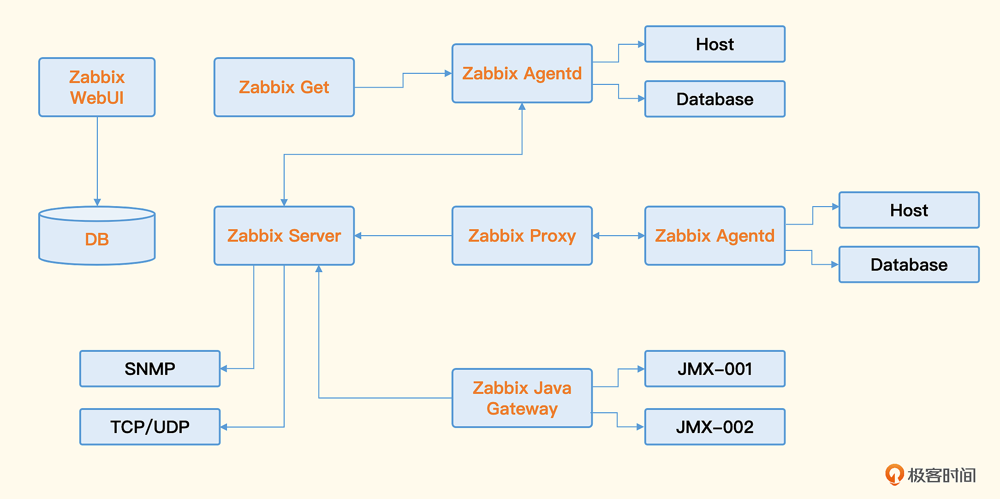
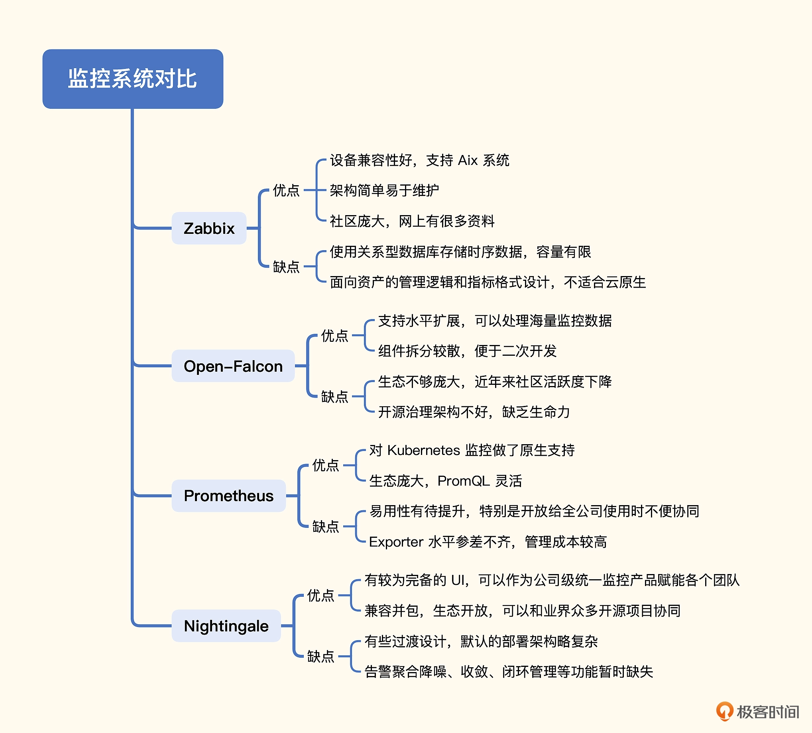

# 01 监控需求以及开源方案的横评对比

## 1. 监控需求来源

最初始的需求，其实就是一句话：**系统出问题了我们能及时感知到**。当然，随着时代的发展，我们对监控系统提出了更多的诉求，比如：

- 通过监控了解数据趋势，知道系统在未来的某个时刻可能出问题，预知问题。
- 通过监控了解系统的负载情况，方便提前进行扩容等。
- 通过监控来给系统调优，感知到哪里需要优化，比如一些中间件参数的调优。
- 通过监控来洞察业务，提供业务决策的数据依据，及时感知业务异常。

目前监控系统越来越重要，同时也越来越完备。不但能够很好地解决上面这几点诉求，还沉淀出了很多监控系统中的稳定性相关的知识。当然，这得益于对监控体系的持续运营，特别是一些资深工程师的持续运营的成果。

## 2. 可观测性三大支柱

我们所说的监控系统，其实只是指标监控，通常使用折线图形态呈现在图表上，比如某个机器的 CPU 利用率、某个数据库实例的流量或者网站的在线人数，都可以体现为随着时间而变化的趋势图。

### 2.1 监控指标

**指标监控**只能处理数字，但它的历史数据存储成本较低，实时性好，生态庞大，是可观测性领域里最重要的一根支柱。聚焦在指标监控领域的开源产品有 Zabbix、Open-Falcon、Prometheus、Nightingale 等。

### 2.2 日志

除了指标监控，另一个重要的可观测性支柱是**日志**。从日志中可以得到很多信息，对于了解软件的运行情况、业务的运营情况都很关键。比如操作系统的日志、接入层的日志、服务运行日志，都是重要的数据源。

从操作系统的日志中，可以得知很多系统级事件的发生；从接入层的日志中，可以得知有哪些域名、IP、URL  收到了访问，是否成功以及延迟情况等；从服务日志中可以查到  Exception  的信息，调用堆栈等，对于排查问题来说非常关键。但是日志数据通常量比较大，不够结构化，存储成本较高。处理日志这个场景，也有很多专门的系统，比如开源产品 ELK 和 Loki，商业产品 Splunk 和 Datadog。

### 2.3 链路追踪

可观测性最后一大支柱是链路追踪。随着微服务的普及，原本的单体应用被拆分成很多个小的服务，服务之间有错综复杂的调用关系，一个问题具体是哪个模块导致的，排查起来其实非常困难。

链路追踪的思路是以请求串联上下游模块，为每个请求生成一个随机字符串作为请求 ID。服务之间互相调用的时候，把这个 ID 逐层往下传递，每层分别耗费了多长时间，是否正常处理，都可以收集起来附到这个请求 ID  上。后面追查问题时，拿着请求 ID 就可以把串联的所有信息提取出来。链路追踪这个领域也有很多产品，比如  **Skywalking**、Jaeger、Zipkin 等，都是个中翘楚。

虽然我们把可观测性领域划分成了 3 大支柱，但实际上它们之间是有很强的关联关系的。比如我们经常会从日志中提取指标，转存到指标监控系统，或者从日志中提取链路信息来做分析，这在业界都有很多实践。

## 3.业界方案横评

了解业界典型方案的一些优缺点，对选型有很大帮助。这里我们主要是评价开源方案，其实业内还有很多商业方案，特别是像 IBM Tivoli 这种产品，更是在几十年前就出现了，但是因为是商业产品，接触的人相对较少，这里就不点评了。

### 3.1 老一代整体方案的代表  Zabbix

Zabbix 是一个企业级的开源解决方案，擅长设备、网络、中间件的监控。因为前几年使用的监控系统主要就是用来监控设备和中间件的，所以 Zabbix 在国内应用非常广泛。

Zabbix  核心由两部分构成，Zabbix Server 与可选组件 Zabbix Agent。Zabbix Server 可以通过  SNMP、Zabbix Agent、JMX、IPMI 等多种方式采集数据，它可以运行在  Linux、Solaris、HP-UX、AIX、Free BSD、Open BSD、OS X 等平台上。

Zabbix 还有一些配套组件，Zabbix Proxy、Zabbix Java Gateway、Zabbix Get、Zabbix WEB 等，共同组成了 Zabbix 整体架构。

#### Zabbix  的优点

- 对各种设备的兼容性较好，Agentd 不但可以在 Windows、Linux 上运行，也可以在 Aix  上运行。
- 架构简单，使用数据库做时序数据存储，易于维护，备份和转储都比较容易。
- 社区庞大，资料多。Zabbix 大概是 2012  年开源的，因为发展的时间比较久，在网上可以找到海量的资源。

#### Zabbix 的缺点

- 使用数据库做存储，无法水平扩展，容量有限。如果采集频率较高，比如 10 秒采集一次，上限大约可以监控 600 台设备，还需要把数据库部署在一个很高配的机器上，比如 SSD 或者 NVMe  的盘才可以。
- Zabbix 面向资产的管理逻辑，监控指标的数据结构较为固化，没有灵活的标签设计，面对云原生架构下动态多变的环境，显得力不从心

### 3.2 老一代国产代表  Open-Falcon

Open-Falcon 出现在 Zabbix 之后，开发的初衷就是想要解决 Zabbix  的容量问题。Open-Falcon 最初来自小米，14 年开源，当时小米有 3 套 Zabbix，1 套业务性能监控系统  perfcounter。

Open-Falcon 的初衷是想做一套大一统的方案，来解决这个乱局。你可以看一下 Open-Falcon 的架构图

Open-Falcon 基于 RRDtool  做了一个分布式时序存储组件 Graph。这种做法可以把多台机器组成一个集群，大幅提升海量数据的处理能力。前面负责转发的组件是  Transfer，Transfer 对监控数据求取一个唯一 ID，再对 ID 做哈希，就可以生成监控数据和 Graph 实例的对应关系，这就是  Open-Falcon 架构中最核心的分片逻辑。

结合我们给出的架构图来看，告警部分是使用  Judge 模块来做的，发送告警事件的是 Alarm 模块，采集数据的是 Agent，负责心跳的模块是 HBS，负责聚合监控数据的模块是  Aggregator，负责处理数据缺失的模块是 Nodata。当然，还有用于和用户交互的 Portal/Dashboard 模块。

Open-Falcon 把组件拆得比较散，组件比较多，部署起来相对比较麻烦。不过每个组件的职能单一，二次开发会比较容易，很多互联网公司都是基于 Open-Falcon 做了二次开发，比如美团、快网、360、金山云、新浪微博、爱奇艺、京东、SEA 等。

#### Open-Falcon 的优点

- 可以处理大规模监控场景，比 Zabbix  的容量要大得多，不仅可以处理设备、中间件层面的监控，也可以处理应用层面的监控，最终替换掉了小米内部的 perfcounter 和三套  Zabbix。
- 组件拆分得比较散，大都是用 Go 语言开发的，Web 部分是用 Python，易于做二次开发。

#### Open-Falcon 的缺点

- 生态不够庞大，是小米公司在主导，很多公司做了二次开发，但是都没有回馈社区，有一些贡献者，但数量相对较少。
- 开源软件的治理架构不够优秀，小米公司的核心开发人员离职，项目就停滞不前了，小米公司后续也没有大的治理投入，相比托管在基金会的项目，缺少了生命力。

### 3.3 新一代整体方案代表  Prometheus

rometheus 的设计思路来自 Google 的 Borgmon，师出名门，就像 Borgmon 是为 Borg 而生的，而 Prometheus 就是为 Kubernetes  而生的。它针对 Kubernetes 做了直接的支持，提供了多种服务发现机制，大幅简化了 Kubernetes 的监控。

在 Kubernetes 环境下，Pod 创建和销毁非常频繁，监控指标生命周期大幅缩短，这导致类似 Zabbix 这种面向资产的监控系统力不从心，而且云原生环境下大都是微服务设计，服务数量变多，指标量也呈爆炸态势，这就对时序数据存储提出了非常高的要求。

Prometheus 1.0 的版本设计较差，但从 2.0 开始，它重新设计了时序库，性能、可靠性都有大幅提升，另外社区涌现了越来越多的 Exporter 采集器，非常繁荣。以下是 Prometheus 的架构图。

#### Prometheus 的优点

- 对 Kubernetes  支持得很好，目前来看，Prometheus 就是 Kubernetes 监控的标配。
- 生态庞大，有各种各样的  Exporter，支持各种各样的时序库作为后端的 Backend 存储，也有很好的支持多种不同语言的 SDK，供业务代码嵌入埋点。

#### Prometheus 的缺点

- 易用性差一些，比如告警策略需要修改配置文件，协同起来比较麻烦。当然了，对于 IaC （基础设施即代码）落地较好的公司，反而认为这样更好，不过在国内当下的环境来看，还无法走得这么靠前，大家还是更喜欢用 Web  界面来查看监控数据、管理告警规则。
- Exporter 参差不齐，通常是一个监控目标一个  Exporter，管理起来成本比较高。
- 容量问题，Prometheus 默认只提供单机时序库，集群方案需要依赖其他的时序库。

### 3.4 新一代国产代表  Nightingale （夜莺）

Nightingale 可以看做是  Open-Falcon 的一个延续，因为开发人员是一拨人，不过两个软件的定位截然不同，Open-Falcon 类似  Zabbix，更多的是面向机器设备，而 Nightingale 不止解决设备和中间件的监控，也希望能一并解决云原生环境下的监控问题。

但是在  Kubernetes  环境下，Prometheus 已经大行其道，再重复造轮子意义不大，所以  Nightingale 的做法是和  Prometheus  做良好的整合，打造一个更完备的方案。当下的架构，主要是把  Prometheus 当成一个时序库，作为  Nightingale  的一个数据源。如果不使用  Prometheus 也没问题，比如使用  VictoriaMetrics 作为时序库，也是很多公司的选择

> [VictoriaMetrics(VM)](https://victoriametrics.com/) 是一个支持高可用、经济高效且可扩展的监控解决方案和时间序列数据库，可用于 Prometheus 监控数据做长期远程存储。主要有以下优势：
>
> - 对外支持 Prometheus 相关的 API，可以直接用于 Grafana 作为 Prometheus 数据源使用（可以直接使用VictoriaMetrics 对接grafana)
> - 指标数据摄取和查询具备高性能和良好的可扩展性，性能比 InfluxDB 和 TimescaleDB 高出 20 倍
> - 在处理高基数时间序列时，内存方面也做了优化，比 InfluxDB 少 10x 倍，比 Prometheus、Thanos 或 Cortex 少 7 倍
> - 高性能的数据压缩方式，与 TimescaleDB 相比，可以将多达 70 倍的数据点存入有限的存储空间，与 Prometheus、Thanos 或 Cortex 相比，所需的存储空间减少 7 倍
> - 它针对具有高延迟 IO 和低 IOPS 的存储进行了优化
> - 提供全局的查询视图，多个 Prometheus 实例或任何其他数据源可能会将数据摄取到 VictoriaMetrics
> - 操作简单
>
> - VictoriaMetrics 由一个没有外部依赖的小型可执行文件组成
> - 所有的配置都是通过明确的命令行标志和合理的默认值完成的
> - 所有数据都存储在 - storageDataPath 命令行参数指向的目录中
> - 可以使用 vmbackup/vmrestore 工具轻松快速地从实时快照备份到 S3 或 GCS 对象存储中
>
> - 支持从第三方时序数据库获取数据源
>   由于存储架构，它可以保护存储在非正常关机（即 OOM、硬件重置或 kill -9）时免受数据损坏
>   同样支持指标的 relabel 操作

#### Nightingale 的优点

- 有比较完备的  UI，有权限控制，产品功能比较完备，可以作为公司级统一的监控产品让所有团队共同使用。Prometheus  一般是每个团队自己用自己的，比较方便。如果一个公司用同一套 Prometheus 系统来解决监控需求会比较麻烦，容易出现我们上面说的协同问题，而 Nightingale 在协同方面做得相对好一些。
- 兼容并包，设计上比较开放，支持对接  Categraf、Telegraf、Grafana-Agent、Datadog-Agent 等采集器，还有 Prometheus 生态的各种  Exporter，时序库支持对接 Prometheus、VictoriaMetrics、M3DB、Thanos 等。

#### Nightingale  的缺点

- 考虑到机房网络割裂问题，告警引擎单独拆出一个模块下沉部署到各个机房，但是很多中小公司无需这么复杂的架构，部署维护起来比较麻烦。
- 告警事件发送缺少聚合降噪收敛逻辑，官方的解释是未来会单独做一个事件中心的产品，支持 Nightingale、Zabbix、Prometheus 等多种数据源的告警事件，但目前还没有放出。
- 上面我介绍了 4  种典型方案，每种方案各有优缺点，如果你的主要需求是监控设备，推荐你使用 Zabbix；如果你的主要需求是监控 Kubernetes，可以选择  Prometheus+Grafana；如果你既要兼顾传统设备、中间件监控场景，又要兼顾 Kubernetes，做成公司级方案，推荐你使用  Nightingale。

## 4. 总结

