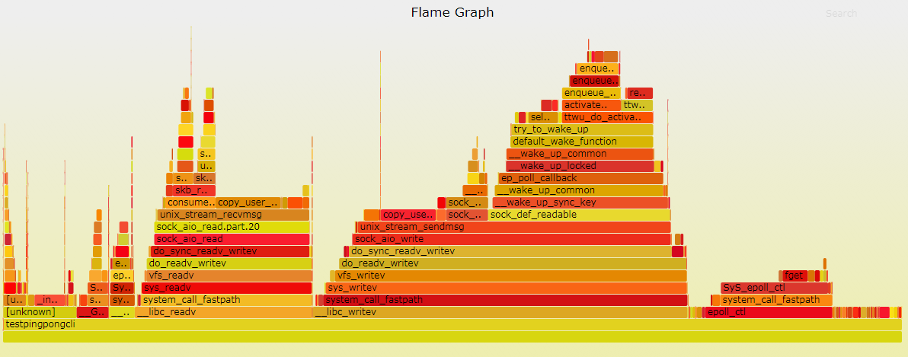
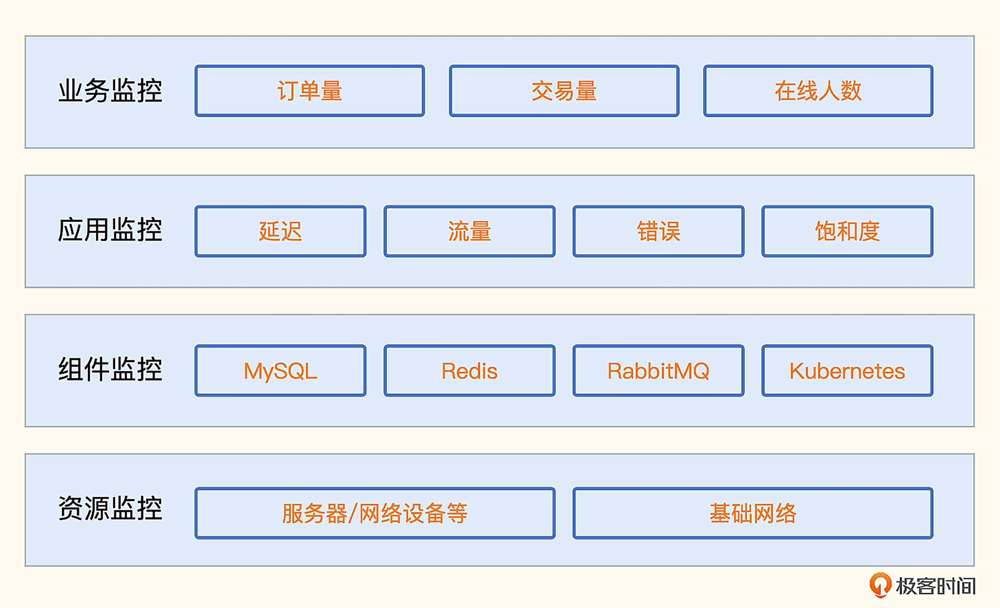

# 09 监控数据采集方法论

要监控的目标五花八门，怎样才能让监控数据更加完备，怎样才能知道哪些指标更加重要，解决这些问题都需要监控方法论的指导。目前业界比较流行的方法论有 Google 的四个黄金指标、RED 方法、USE 方法，下面一一介绍一下。

## 1. 监控方法

### 1.1 Google 的四个黄金指标

Google 的四个黄金指标着眼点在服务监控，这四个指标分别是延迟、流量、错误和饱和度。

- **延迟**：服务请求所花费的时间，比如用户获取商品列表页面调用的某个接口，花费 30 毫秒。这个指标需要区分成功请求和失败请求，因为失败的请求可能会立刻返回，延迟很小，会扰乱正常的请求延迟数据。
- **流量**：HTTP 服务的话就是每秒 HTTP 请求数，RPC 服务的话就是每秒 RPCCall 的数量，如果是数据库，可能用数据库系统的事务量来作为流量指标。
- **错误**：请求失败的速率，即每秒有多少请求失败，比如 HTTP 请求返回了 500 错误码，说明这个请求是失败的，或者虽然返回的状态码是 200，但是返回的内容不符合预期，也认为是请求失败。
- **饱和度**：描述应用程序有多“满”，或者描述受限的资源，比如 CPU 密集型应用，CPU 使用率就可以作为饱和度指标。

有了这个方法论的指导，我们就知道服务监控应该重点关注哪些指标了。如果要为某个服务配置监控大盘，监控大盘里就要包含上述这几类指标。如果要配置告警规则，也要重点照顾这几类指标。

可以这么说，只要上述这些指标都是正常的，这个服务就是健康的。反之，如果这些指标有问题，服务就是不健康的，并且大概率已经影响了上游服务甚至终端用户。

Google 的四个黄金指标主要是针对服务的监控，Weaveworks 的工程师认为饱和度这个指标比较高级，延迟、流量、错误这三个指标相对更重要，所以将其简化为 RED 方法，下面我们来看一下 RED 方法的定义。

### 1.2 RED 方法

- （Request）Rate：请求速率，每秒请求数。
- （Request）Errors：错误，每秒错误请求数
- （Request）Duration：延迟，每个请求的延迟分布情况。

三个英文单词取首字母组成 RED  方法，姑且可以看做是 Google 四个黄金指标的简化版，作者很逗，说为什么起名为 RED 呢？因为他们内部普遍应用 USE 方法，为了和  USE 相呼应，所以取了 RED 这个自认为响亮的名字。

### 1.3 USE 方法

USE 方法的提出者是大名鼎鼎的 Brendan Gregg，如果你没听过这个名字，也没关系，你应该听过火焰图吧，性能分析用的火焰图就是这位大哥发明的。你可以点开 USE 方法的官方介绍看看。



USE  是**使用率（Utilization）**、**饱和度（Saturation）**、**错误（Error）**的缩写，主要用于分析**资源问题。**

什么是资源？在 Gregg  对模型的定义中，是指传统意义上的物理服务器组件，比如  CPU、硬盘等，但现在很多人已经扩展了资源的范围，把一些软件资源也包含在内。

- 使用率：这个我们最熟悉，比如内存使用率、CPU  使用率等，是一个百分比。
- 饱和度：资源排队工作的指标，无法再处理额外的工作。通常用队列长度表示，比如在 iostat 里看到的 aqu-sz  就是队列长度。
- 错误：资源错误事件的计数。比如 malloc() 失败次数、通过 ifconfig 看到的 errors、dropped  包量。有很多错误是以系统错误日志的方式暴露的，没法直接拿到某个统计指标，此时可以进行日志关键字监控。

USE 方法和 Google 四个黄金指标配合使用，我们就可以知道不同类别的监控对象应该关注的核心指标是什么了。

## 2. 监控分类

那监控对象都有哪些类别呢？换句话说，我们做了哪些方面的监控才算是把监控体系建设完备了？下面我们就来梳理一下监控对象的类别。



### 2.1 业务监控

这类指标是管理层非常关注的，代表企业营收，或者跟客户主流程相关，类似 BI 数据。不过相比 BI 数据，业务监控指标有两点不同。

- **对精确度要求没有那么高**：因为监控只要发现趋势异常就可以，至于是从 5000 变成了 1000 还是变成了 1001，没有什么区别。
- **对实时性要求很高**：很多 BI 数据可能是小时级别或天级别的，这个时效性无法满足监控的需求，监控是希望越早发现问题越好，要是一个小时才发现问题，黄花菜都凉了。

技术人员应该针对这类指标做高优保障，如果所有的指标都同等对待，重要的告警就容易被普通告警淹没，所以告警一定要**分级对待**。

很多公司的故障管理比较粗放，只要有报警事件产生，就认为是有故障，这是不对的。在微服务和云原生技术盛行的当下，某个机器的 CPU 飙高了，或者 IO  打满了，对最终用户的体验可能是没有任何影响的，但是核心业务指标异常，一定是故障，因为这类指标异常代表着最终用户体验受损，或者造成了直接资损。

作为中后台的团队，做的很多稳定性保障的工作不容易让管理层看到，业务指标是一个突破口，如果能够把这类指标梳理清楚，是很容易让老板看到我们的价值的。

### 2.2 应用监控

应用监控就是指对应用程序（Application）的监控，Google 的四个黄金指标、RED 方法主要就是针对应用监控的。

每个公司都应该有统一的  APM（Application Performance Management），也就是应用性能管理方案，从指标着手的话一般使用埋点机制来做，比如 StatsD、Prometheus SDK 等，或者直接分析接入层日志，从日志提取指标；从链路追踪着手的话可以使用  Zipkin、**SkyWalking** 等。

像 Java 这种字节码技术的语言，采用 Java Agent 技术可以做到代码无侵入埋点。但是像 Go、C++ 这类语言，一般都是采用埋点机制来做，由统一的工具团队提供一些框架，在框架里内置埋点逻辑，这样普通研发人员也就基本不会有代码侵入的感觉了。

### 2.3 组件监控

这里我们把各类数据库、中间件、云平台，统称为组件，组件监控是非常考验知识广度的。一般监控系统的研发人员，很难把每个组件的机理都搞清楚，所以定义统一的接入数据规范，让专业的人去采集各个组件的数据是更合理的做法。

有个好现象是，很多组件的研发人员，已经开始让组件自身直接支持 Prometheus 协议，吐出 metrics 数据，除了 etcd、Kubernetes 这些云原生时代的组件，一些老的组件，比如  RabbitMQ、ZooKeeper 等，也在新版本里直接做了支持，实属行业幸事。

### 2.4 资源监控

基础资源的监控，主要是针对设备和网络，设备又分为服务器、网络设备，网络监控又分为连通性监控、质量监控、流量监控。下面我们分别做个简单介绍。

#### 2.4.1 设备监控

一提起设备监控，你可能立马会想到 CPU、内存使用率监控，除了这些之外，如果我们想获取硬件模块的健康状况，比如电源电压、风扇转速、主板环境温度等，就需要走 IPMI 协议，通过带外网络采集。

网络设备，典型的就是交换机、防火墙，一般是通过 SNMP 协议获取指标，比如交换机各个网口的流量、包量。也可以通过 syslog 的方式，把交换机的日志转存出来，到服务器上分析。

#### 2.4.2 网络监控

网络连通性监控最为常见，通过 ICMP 协议，部署探针机器，对目标设备做 PING 探测，能探通就表示能连通，探测失败就是连不通。当然，有些机器可能是禁 PING 的，此时就需要用 TCP 或 HTTP 之类的协议去探测了。

PING 探测可以拿到丢包率和延迟数据，我们可以用这些数据分析网络质量。比如两个机房之间的专线，我们用 A 机房的探针去探测 B 机房的目的设备，就能轻易知道机房之间的网络质量情况。

最后是流量监控，也会用在多个地方，比如机器的网卡流量、交换机的网口流量、机房出口流量，也是整个监控体系的重要一环。

上面的分类主要是针对服务端的监控，还有一个大类是端监控，比如 iOS 应用，我们会关注是否卡顿、有没有崩溃、白屏之类的，这算是另一个领域，这里就不展开介绍了。

## 3. 监控的采集方式

监控采集数据的方法是相当多样的，比如读取 /proc  目录、执行系统调用、执行命令行工具、远程黑盒探测、远程拉取特定协议的数据、连到目标上去执行指令获取输出、代码埋点、日志分析提取等各种各样的方法。

下面我们就按照使用频率从高到低依次看一下，先来看读取 /proc 目录的方式。

### 3.1 读取 `/proc` 目录

`/proc` 是一个位于内存中的伪文件系统，该目录下保存的不是真正的文件和目录，而是一些“**运行时**”信息，Linux 操作系统层面的很多监控数据，比如内存数据、网卡流量、机器负载等，都是从` /proc `中获取的信息。

我们先来看一下内存相关的指标

```shell

[root@demo ~]# cat /proc/meminfo
MemTotal:        7954676 kB
MemFree:          211136 kB
MemAvailable:    2486688 kB
Buffers:          115068 kB
Cached:          2309836 kB
...
```

内存总量、剩余量、可用量、Buffer、Cached 等数据都可以轻易拿到。当然，`/proc/meminfo` 没有使用率、可用率这样的百分比指标，这类指标需要二次计算，可以在客户端采集器中完成，也可以在服务端查询时现算。

内存相关的指标都是 Gauge 类型的，下面我们再来看一下网卡流量相关的指标，网卡相关的数据都是 Counter 类型的数据。

```shell

[root@demo ~]# head -n3 /proc/net/dev
Inter-|   Receive                                                |  Transmit
 face |bytes    packets errs drop fifo frame compressed multicast|bytes    packets errs drop fifo colls carrier compressed
  eth0: 697407964307 2580235035    0    0    0     0          0         0 1969289573661 3137865547    0    0    0     0       0          0
```

通过 head 命令查看前面几行，可以看到  eth0 网卡的指标值。整体上分两部分，前一部分是 Receive，表示入方向，后一部分是  Transmit，表示出方向。697407964307 这个值表示 eth0 网卡入方向收到的 byte 总量，2580235035 则表示  eth0 网卡入方向收到的 packet 总量。

注意了，这里所谓的总量，是指操作系统启动以来的累计值。从监控角度，通常我们不关注这个总量，而是关注最近一分钟或者最近一秒钟的流量是多少，所以在服务端看图的时候，通常要使用 irate 函数做二次计算。

看到这里，你可能会觉得，OS  层面的监控很简单，不就是读取 `/proc` 目录下的内容吗？这倒也不尽然，有些数据从 /proc 下面是拿不到的，比如硬盘使用率。我们可以从  /proc/mounts 拿到机器的挂载点列表，但具体每个挂载点的使用率，就需要系统调用了。

OS 内的数据采集，除了读取` /proc `目录之外，也经常会通过执行命令行工具的方式采集指标，下面我们再来看一下这种方式。

### 3.2 执行命令行工具

这种方式非常简单，就是调用一下系统命令，解析输出就可以了。比如我们想获取 9090 端口的监听状态，可以使用 ss 命令 `ss -tln|grep 9090`，想要拿到各个分区的使用率可以通过 df 命令 df -k。但是这个方式不太通用，性能也不好。

先说通用性问题，就拿 ss  命令来说吧，**不是所有的机器都安装了这个命令行工具**，而且不同的发行版或不同 ss  版本，命令**输出内容格式可能不同**。性能问题也容易理解，调用命令行工具是需要 fork  一个进程的，相比于进程内的逻辑，效率大打折扣，不过监控采集频率一般都是 10  秒起步，不频繁，所以这个性能问题倒不是什么大事，关键还是通用性问题。

读取本地 `/proc` 目录或执行命令行工具，都是在目标监控机器上进行的操作。有的时候，我们无法在目标机器上部署客户端程序，这时候就需要黑盒探测手段了。

### 3.3 远程黑盒探测

典型的探测手段有三类，ICMP、TCP 和 HTTP。有一个软件叫 Blackbox Exporter，就是专门用来探测的，Categraf、Datadog-Agent 等采集器也都可以做这种探测。

ICMP 协议，我们可以通过 Ping 工具做测试，你可以看一下这个例子。

```shell

[root@dev01.nj ~]# ping -c 3 www.baidu.com
PING www.a.shifen.com (180.101.49.13) 56(84) bytes of data.
64 bytes from 180.101.49.13 (180.101.49.13): icmp_seq=1 ttl=251 time=1.41 ms
64 bytes from 180.101.49.13 (180.101.49.13): icmp_seq=2 ttl=251 time=1.39 ms
64 bytes from 180.101.49.13 (180.101.49.13): icmp_seq=3 ttl=251 time=1.38 ms

--- www.a.shifen.com ping statistics ---
3 packets transmitted, 3 received, 0% packet loss, time 2003ms
rtt min/avg/max/mdev = 1.382/1.393/1.405/0.009 ms
```

这里我们使用 Ping 工具向 Baidu 发了 3 个数据包，得到了多个指标数据。

- 丢包率：0%
- min rtt：1.382
- avg rtt：1.393
- max rtt：1.405
- ttl：251

监控采集器和手工 Ping  测试的原理是一样的，也是发几个包做统计。不过**有些机器是禁 Ping 的**，这时候我们就可以通过 TCP 或 HTTP 来探测。对于 Linux  机器，一般是会开放 sshd 的 22 端口，那我们就可以用类似 telnet 的方式探测机器的 22 端口，如果成功就认为机器存活。

对于 HTTP 协议的探测，除了基本的连通性测试，还可以检查协议内容，比如要求返回的 status code 必须是 200，返回的 response body 必须包含 success 字符串，如果任何一个条件没有满足，从监控的角度就认为是异常的。

有黑盒监控，自然就有白盒监控。黑盒监控是把监控对象当成一个黑盒子，不去了解其内部运行机理，只是通过几种协议做简单探测。白盒监控与之相反，它要收集能够反映监控对象内部运行健康度的指标。但是监控对象的内部指标，从外部其实是无法拿到的，所以白盒监控的指标，需要监控对象自身想办法暴露出来。最典型的暴露方式，就是提供一个 HTTP 接口，在 response body 中返回监控指标的数据。下面我们就来看一下这种采集方式。

### 3.4 拉取特定协议的数据

有很多组件都通过 HTTP 接口的方式，暴露了自身的监控指标，比如 Elasticsearch 的` /_cluster/health` 接口。

```json

[root@dev01.nj ~]# curl  -uelastic:Pass1223 http://10.206.0.7:9200/_cluster/health -s | jq .
{
  "cluster_name": "elasticsearch-cluster",
  "status": "yellow",
  "timed_out": false,
  "number_of_nodes": 3,
  "number_of_data_nodes": 3,
  "active_primary_shards": 430,
  "active_shards": 430,
  "relocating_shards": 0,
  "initializing_shards": 0,
  "unassigned_shards": 430,
  "delayed_unassigned_shards": 0,
  "number_of_pending_tasks": 0,
  "number_of_in_flight_fetch": 0,
  "task_max_waiting_in_queue_millis": 0,
  "active_shards_percent_as_number": 50
}
```

我们可以看到，返回的内容大多是指标数值，转换成监控服务端要求的数据格式，传上去即可。除了 `/_cluster/health` ，还可以测试一下 `/_cluster/stats`，也能帮你了解这种获取指标的方式。

除了  Elasticsearch，还有很多其他组件也是用这种方式来暴露指标的，比如 RabbitMQ，访问 `/api/overview` 可以拿到  Message 数量、Connection 数量等概要信息。再比如 Kubelet，访问 `/stats/summary` 可以拿到 Node 和  Pod 等很多概要信息。

不同的接口返回的内容虽然都是指标数据，但是要推给监控服务端，还是要做一次格式转换，比如统一转换为 Prometheus 的文本格式。要是这些组件都直接暴露 Prometheus  的协议数据就好了，使用统一的解析器，就能大大简化监控采集逻辑。所幸这个趋势正在发生，上一讲我们也提到了，像 etcd、CoreDNS、新版  ZooKeeper、新版 RabbitMQ、nginx-vts 等，都内置暴露了 Prometheus 协议数据，可谓行业幸事。

这种拉取监控数据的方式虽然需要做一些数据格式的转换，但并不复杂。因为目标对象会把需要监控的数据直接通过接口暴露出来，监控采集器把数据拉到本地做格式转换即可。更复杂的方式是需要我们连接到目标对象上执行指令，MySQL、Redis、MongoDB 等都是这种方式，下面我们就来一起看一下这种采集方式的工作原理。

### 3.5 连接到目标对象执行命令

目前最常用的数据库就是 MySQL 和 Redis 了，我们就拿这两个组件来举例。先说 MySQL，我们经常需要获取一些连接相关的指标数据，比如当前有多少连接，总共拒绝了多少连接，总共接收过多少连接，登录 MySQL 命令行，使用下面的命令可以获取。

```mysql

mysql> show global status like '%onn%';
+-----------------------------------------------+---------------------+
| Variable_name                                 | Value               |
+-----------------------------------------------+---------------------+
| Aborted_connects                              | 3212                |
| Connection_errors_accept                      | 0                   |
| Connection_errors_internal                    | 0                   |
| Connection_errors_max_connections             | 0                   |
| Connection_errors_peer_address                | 0                   |
| Connection_errors_select                      | 0                   |
| Connection_errors_tcpwrap                     | 0                   |
| Connections                                   | 3281                |
| Locked_connects                               | 0                   |
| Max_used_connections                          | 13                  |
| Max_used_connections_time                     | 2022-10-30 16:41:35 |
| Performance_schema_session_connect_attrs_lost | 0                   |
| Ssl_client_connects                           | 0                   |
| Ssl_connect_renegotiates                      | 0                   |
| Ssl_finished_connects                         | 0                   |
| Threads_connected                             | 1                   |
+-----------------------------------------------+---------------------+
16 rows in set (0.01 sec)
```

Threads_connected  表示当前有多少连接，Max_used_connections 表示曾经最多有多少连接，Connections  表示总计接收过多少连接。当然，除了连接数相关的指标，通过 `show global status` 还可以获取很多其他的指标，这些指标用于表示  MySQL 的运行状态，随着实例运行，这些数据会动态变化。

还有另一个命令` show global variables `可以获取一些全局变量信息，比如使用下面的命令可以获取 MySQL 最大连接数。

```mysql

mysql> show global variables like '%onn%';
+-----------------------------------------------+-----------------+
| Variable_name                                 | Value           |
+-----------------------------------------------+-----------------+
| character_set_connection                      | utf8            |
| collation_connection                          | utf8_general_ci |
| connect_timeout                               | 10              |
| disconnect_on_expired_password                | ON              |
| init_connect                                  |                 |
| max_connect_errors                            | 100             |
| max_connections                               | 5000            |
| max_user_connections                          | 0               |
| performance_schema_session_connect_attrs_size | 512             |
+-----------------------------------------------+-----------------+
9 rows in set (0.01 sec)
```

其中 max_connections 就是最大连接数，这个数值默认是 151。在很多生产环境下，都应该调大，所以我们要把这个指标作为一个告警规则监控起来，如果发现这个数值太小要及时告警。

当然，除了刚才介绍的两个命令，我们还可以执行其他命令获取其他数据库指标，比如 show slave status 可以获取 Slave 节点的信息。总的来看，MySQL 监控的原理就是，连上 MySQL 后执行各种  SQL 语句，解析结果，转换为监控时序数据。

上面例子中的 SQL 语句都是用来获取 MySQL 实例运行状态的。实际上，既然可以执行 SQL 语句，我们就可以自定义一些 SQL 来查询业务数据，获取业务指标。上一讲我们也提到过，业务指标数据是整个监控体系中价值最大的，我们要好好利用这个能力。

比如有个 orders 表存储了订单数据，那我们就可以使用下面的语句获取订单总量。

```mysql
select count(*) as order_total from orders
```

把 order_total 这个返回值作为最终的监控数据上报即可。这种方式对于一些比较简单的单表场景还是挺好用的。但如果业务侧有分库分表，就需要用一些更复杂的手段来解决了。

Redis 也是类似的，比如我们通过 redis-cli 登录到命令行，执行 info memory 命令，就可以看到很多内存相关的指标。

```mysql

127.0.0.1:6379> info memory
# Memory
used_memory:1345568
used_memory_human:1.28M
used_memory_rss:3653632
used_memory_rss_human:3.48M
used_memory_peak:1504640
used_memory_peak_human:1.43M
used_memory_peak_perc:89.43%
used_memory_overhead:1103288
used_memory_startup:1095648
used_memory_dataset:242280
used_memory_dataset_perc:96.94%
...
```

输出的指标是 Key:Value 的格式，Value 部分有的带着单位，解析的时候需要注意一下，做一个格式转换。

有些业务数据可能是存在 Redis 里的，所以监控 Redis 不只是获取 Redis 自身的指标，还应该支持自定义命令，获取一些业务数据，比如下面的命令，用于获取订单总量。

```shell
get /orders/total
```

这个例子是假设业务程序会自动更新 Redis Key：/orders/total，用这个 Key 来存放订单总量。

讲到这里，我们就把常见的 OS 和中间件的监控讲完了，按照上一讲的监控分层架构图，接下来就是应用监控和业务监控，应用监控和业务监控有两种典型的采集手段，一个是埋点，一个是日志解析。

### 3.6 代码埋点

所谓的代码埋点方式，是指应用程序内嵌一些监控相关的 SDK，在请求的关键链路上调用 SDK 的方法，告诉 SDK 当前是个什么请求、耗时多少、是否成功之类的，SDK 汇总这些数据并二次计算，最终推给监控服务端。

比如一个用 Go 写的 Web 程序，提供了  10 个 HTTP 接口，我们想获取这 10  个接口的成功率和延迟数据，那就要写程序实现这些逻辑，包括数据采集、统计、转发给服务端等。这些监控相关的逻辑是典型的横向需求，这个 Web  程序有需求，其他的程序也有这个需求，所以就把这部分代码抽象成一个统一的 Lib，即上面提到的这个 SDK，每个需要监控逻辑的程序都可以复用这个  SDK，提升效率。

但是每个项目都要调用这个 SDK  的方法仍然显得很冗余，是否有更简单的办法呢？有！每个公司可以建立统一的框架开发团队，开发统一的 HTTP 框架，在框架里**使用 AOP  的编程方式，内置采集这些监控数据**。这样一来，只要某个团队用了这个统一的 HTTP 框架，就自动具备了监控埋点能力。同理，我们也可以构建统一的  RPC 调用框架，统一的 MySQL 调用框架，这样就逐步构建了统一且完备的应用监控数据收集体系。

这种方式需要内嵌  SDK，对代码有侵入性，是否有更简单的办法呢？有！对于 Java 这种字节码语言，我们可以使用 `JavaAgent  `技术，动态修改字节码，自动获取监控数据，到 Google 上通过关键词“javaagent monitoring”可以找到很多资料。

当然，现在也开始流行 **eBPF** 技术，有些厂商在尝试，你也可以关注下。不过在生产实践中，我观察大部分厂商还是在用埋点的方式采集监控数据，后面第 19 讲我会专门给你演示如何做埋点。

对于自研的程序，代码埋点是没问题的，但是很多程序可能是外采的，我们没法修改它的源代码，这时候就要使用日志解析的方式了。一般程序都会打印日志，我们可以写日志解析程序，从日志中提取一些关键信息，比如从业务日志中很容易拿到 Exception 关键字出现的次数，从接入层日志中很容易就能拿到某个接口的访问次数。