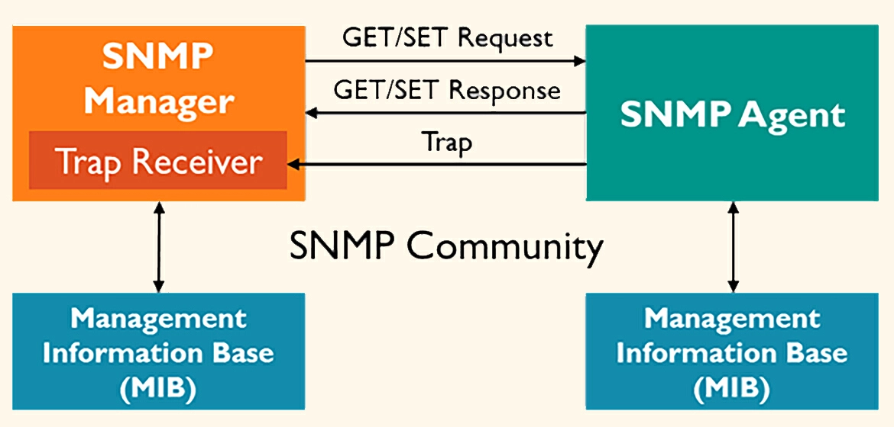
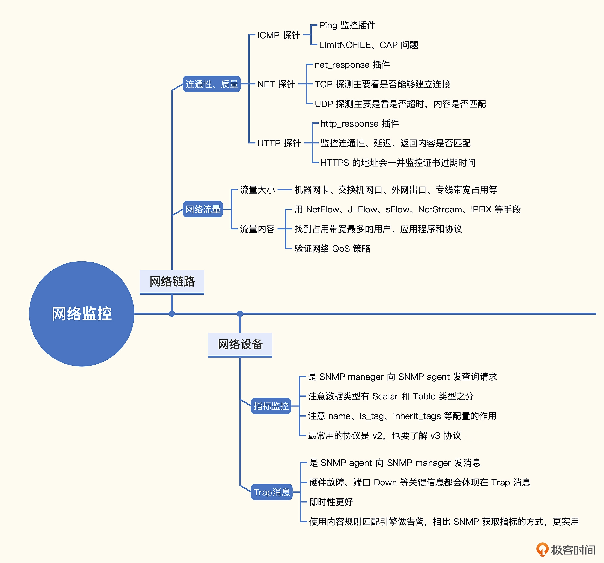

# 10. 网络监控

除了机器之外，还有一个常见的基础设施，就是网络。**网络监控主要包括网络链路监控和网络设备监控**，通常系统运维人员会比较关注。今天我们就来揭开网络监控的面纱，看看其中涉及了哪些关键技术和实践方法。

## 1. 网络链路监控

网络链路监控主要包含三个部分，网络连通性、网络质量、网络流量。

连通性和质量的监控手段非常简单，就是在链路一侧部署探针，去探测链路另一侧的目标，通过 ICMP、TCP、HTTP 等协议发送探测数据包，分析回包的结果。典型的指标有丢包率、延迟、回包是否匹配预期条件等。

网络流量监控，则关注流量大小以及流量内容。流量大小广泛应用于水位管理，比如机器网卡、交换机的接口、外网出口、专线带宽等，及时发现网络瓶颈。分析流量内容，则可以识别过度耗用带宽的用户和应用程序，验证网络 QoS 策略等。

这一讲我们使用 Categraf 来演示一下常用探针的配置方式，进行网络连通性和质量监控。网络流量大小，可以使用 SNMP 采集数据，相关方法我们会在后面介绍网络设备监控时讲解。流量内容监控我暂时没有找到开源方案，如果你知道的话，欢迎留言分享。

### 1.1 ICMP 探测

Categraf 的 ICMP 探测使用 Ping 插件，相关配置在` conf/input.ping/ping.toml`，主要是配置要探测的目标地址，下面是样例。

```toml
[[instances]]
targets = [ "10.4.5.6", "10.4.5.7" ]
labels = { region="cloud", product="n9e" }

[[instances]]
targets = [ "10.4.5.8" ]
labels = { region="cloud", product="zbx" }
```

例子中是 Ping 3 个地址，其中有两个机器是 Nightingale 产品使用的，有一个机器是 Zabbix 产品使用的，都位于 cloud 这个区域（region）里，所以打了不同的标签来丰富其维度信息。

如果要同时 Ping 很多台机器，就会占用很多文件句柄，**需要提前调大 Categraf 的文件句柄限制**。如果是用 systemd 来托管，可以在 categraf.service 文件中添加 LimitNOFILE 配置。

```toml

[Service]
LimitNOFILE=8192
```

另一个坑是 CAP 问题，如果使用非 root 账号来运行 Categraf，需要在 categraf.service 文件中添加如下配置。

```toml

[Service]
CapabilityBoundingSet=CAP_NET_RAW
AmbientCapabilities=CAP_NET_RAW
```

Ping 插件可以采集到目标是否连通、延迟时间、丢包率等指标，可以据此做网络链路的监控。比如机房专线的探测，只需要在某个机房部署 Categraf，来探测另一个机房的设备。

最后是仪表盘和告警规则，dashboard.json 是仪表盘配置，alerts.json 是告警规则配置，导入夜莺就可以使用。如果是直接使用的 Prometheus，也可以参考 JSON  文件中的 PromQL，并将其改造成 Prometheus yaml 配置。

### 1.2 TCP 探测

很多时候机器是禁 Ping 的，此时 TCP  探测就派上用场了。TCP 探测用的是 Categraf 的 net_response 插件，配置文件在  conf/input.net_response/net_response.toml。实际这个插件既可以探测 TCP 的响应，也可以探测 UDP  的响应。配置中最核心的是 targets 部分，指定探测的目标。

```toml

[[instances]]
targets = [
    "10.2.3.4:22",
    "localhost:6379",
    ":9090"
]
```

- `10.2.3.4:22 `表示探测  10.2.3.4 这个机器的 22 端口是否可以连通。
- `localhost:6379` 表示探测本机的 6379 端口是否可以连通。
- `:9090`  表示探测本机的 9090 端口是否可以连通，没有写 IP 或主机名的就默认使用 localhost。

原理也很简单，就是 Categraf 向目标地址发起网络连接。如果能连通，就认为是正常的，指标值上报为 0，如果失败就是非 0 的值。监控指标名字是 net_response_result_code。

如果是 UDP  的端口，是无法发起连接探测的。此时采用内容匹配探测，即通过 UDP  发个字符串给探测目标，理论上探测目标很快就会给出回复。我们来检查回复内容，如果回复内容包含特定字符串，就表示探测目标活着。相关配置是 send 和 expect 字段，你可以看一下配置样例。

```toml

## The following options are required for UDP checks. For TCP, they are
## optional. The plugin will send the given string to the server and then
## expect to receive the given 'expect' string back.
## string sent to the server
send = "ping"
## expected string in answer
expect = "pong"
```

net_response 插件也内置了仪表盘和告警规则，可以在代码目录中找到，导入夜莺就可以使用。

### 1.3 HTTP 探测

HTTP 探测和 TCP  的探测逻辑几乎完全一致，只不过 HTTP 是七层协议，Categraf 可以解析到 Status code、Response body  这些更细粒度的信息。相关配置在 `conf/input.http_response/http_response.toml`，我们看一个配置样例。

```toml

[[instances]]
targets = [
    "http://localhost",
    "https://www.baidu.com"
]
```

很多公司都会在所有的机器上部署 Agent，Agent 会开一个 HTTP 端口，这样就可以通过探测这些 HTTP 端口，知道 Agent 是否存活，进而反推机器的存活性。

HTTP 插件可以对返回的 Response 做规则匹配，比如判断 Response body 中是否包含特定的字符串，或者 Status code 是否是指定的值等，你可以看下相关配置。

```shell

## Optional substring match in body of the response (case sensitive)
expect_response_substring = "ok"

## Optional expected response status code.
expect_response_status_code = 200
```

如果目标地址是 HTTPS 的，Categraf 也会自动检查证书过期时间，指标名是 `cert_expire_timestamp`，证书过期时间一定要记得加个告警规则，我见过很多公司因为证书过期而导致线上故障。

## 2. 网络设备监控

网络设备监控的典型手段有三个:

- 一个是 Ping  监控，探测是否存活。
- 另一个是通过 SNMP 获取指标，比如各个网口的状态、流量、包量等。
- 最后一个是 SNMP  Trap，一般网络设备有问题，都会发出 Trap 消息，这些 Trap 消息很有价值，分析这些 Trap  消息是常用且有效的监控手段。

### 2.1 SNMP 指标获取方式

要采集网络设备的监控指标，一定要了解 SNMP  协议。这个内容比较多，你可以结合《SNMP（简单网络管理协议）简介》来理解。简单来讲，就是交换机上有个组件叫 SNMP agent（即  snmpd ），监听 UDP 161 端口，提供查询服务。SNMP manager，比如 Categraf，可以向 SNMP agent  发起查询请求，传入的参数是 OID，SNMP agent 返回 OID 对应的监控数据。

Categraf 提供了 SNMP 插件，配置文件在 `conf/input.snmp/snmp.toml`，核心配置就是 SNMP agent 的连接地址以及要采集的 OID 列表。

```toml

interval = 60

[[instances]]
agents = ["udp://172.30.15.189:161"]

timeout = "5s"
version = 2
community = "public"
agent_host_tag = "ident"
retries = 1

[[instances.field]]
oid = "RFC1213-MIB::sysUpTime.0"
name = "uptime"

[[instances.field]]
oid = "RFC1213-MIB::sysName.0"
name = "source"
is_tag = true

[[instances.table]]
oid = "IF-MIB::ifTable"
name = "interface"
inherit_tags = ["source"]

[[instances.table.field]]
oid = "IF-MIB::ifDescr"
name = "ifDescr"
is_tag = true
```

例子中，配置的交换机地址是 172.30.15.189，认证版本是 version 2，认证团体名是 public。如果是 v3 版本，可能和下面的认证配置差不多。

```shell
version = 3
sec_name = "managev3user"
auth_protocol = "SHA"
auth_password = "example.Demo.c0m"
```

要采集哪些指标，是通过 OID  字段来指定的，instances.field 有两个，一个是获取系统启动时间（OID 是  RFC1213-MIB::sysUpTime.0），一个是获取系统名称（OID 是 RFC1213-MIB::sysName.0），这两个  OID 都是 Scalar 类型，可以使用 snmpget 进行测试。

```shell

snmpget -v2c -c public 172.30.15.189 RFC1213-MIB::sysUpTime.0
```

因为 name = “uptime”  这个配置，指标会命名成 snmp_uptime，snmp 是插件前缀，uptime 就是 name 字段指定的。看起来挺顺畅，但是为什么  sysName 这个 field 多了一个 is_tag = true 的配置呢？因为 sysName  是个字符串，不是要上报的监控数据，它会作为一个标签 source=$sysName 附到所有时序数据上。

instances.table 部分采集的是  Table 类型的数据，Table 的 OID 是 IF-MIB::ifTable，Table 里有多列数据和索引，Categraf 会自动获取 Table 中所有的索引字段，做成时序数据的标签，还会自动获取所有的数据列，作为指标上报。但是，有些列可能不是数值，比如 ifDescr  就是字符串，这个列无需作为指标上报，作为标签上报更合适，所以有个 is_tag=true 的配置。inherit_tags  表示继承下来的标签，ifTable 收集到的数据就会自动附上 source 标签。

ifTable 可以拿到各个网口的出入向流量、包量等，对我们做容量监控很有帮助，当然也可以拿到错包、丢包的情况，这些都是很重要的监控指标。这里我贴几条监控数据，让你有一个直观的认识。

```shell

12:01:36 snmp_interface_ifInNUcastPkts agent_hostname=prober01 ident=172.30.15.189 ifIndex=5 source=SW01 0
12:01:36 snmp_interface_ifInErrors agent_hostname=prober01 ident=172.30.15.189 ifIndex=5 source=SW01 0
12:01:36 snmp_interface_ifOutDiscards agent_hostname=prober01 ident=172.30.15.189 ifIndex=5 source=SW01 0
12:01:36 snmp_interface_ifOutErrors agent_hostname=prober01 ident=172.30.15.189 ifIndex=5 source=SW01 0
```

除了获取指标之外，SNMP Trap 也是很关键的监控手段，**SNMP 指标监控是轮询式，定期采集，而 Trap 是只要有消息就自动通知，即时性更好**。下面我们来看一下 Trap 的相关技术方案。

### 2.2 SNMP Trap

与 SNMP 采集指标的方式不同，Trap  消息是由交换机里的 SNMP agent 发消息给 SNMP manager（也是走的 UDP 协议），与指标采集的数据流向相反。目前  **Categraf 尚不支持 Trap 消息接收**，你可以先用 Telegraf 的 snmp_trap 插件做测试。



用 Trap  机制做事件监控是比较便捷的方式，交换机出现关键问题的时候，都会立刻发出 Trap 消息。我们只要在 Trap Receiver  中配置消息匹配规则，指定什么样的消息应该产生告警即可。但是，匹配规则肯定是需要用人类易读的方式，这就需要**借助 MIB 库**，把 Trap 中的  OID 翻译成人类易读的字符串。不翻译的话，原始的 Trap 消息可能是这样的，很难读懂

```json

{
  "Version": 2,
  "TrapType": 0,
  "OID": null,
  "Other": null,
  "Community": "public",
  "Username": "",
  "Address": "172.16.1.64:49692",
  "VarBinds": {
    ".1.3.6.1.2.1.1.3.0": 7908527690000000,
    ".1.3.6.1.2.1.2.2.1.1.18": 18,
    ".1.3.6.1.2.1.2.2.1.2.18": "Vlanif103",
    ".1.3.6.1.2.1.2.2.1.7.18": 2,
    ".1.3.6.1.2.1.2.2.1.8.18": 2,
    ".1.3.6.1.6.3.1.1.4.1.0": [1, 3, 6, 1, 6, 3, 1, 1, 5, 3]
  },
  "VarBindOIDs": [
    ".1.3.6.1.2.1.1.3.0",
    ".1.3.6.1.6.3.1.1.4.1.0",
    ".1.3.6.1.2.1.2.2.1.1.18",
    ".1.3.6.1.2.1.2.2.1.7.18",
    ".1.3.6.1.2.1.2.2.1.8.18",
    ".1.3.6.1.2.1.2.2.1.2.18"
  ]
}
```

不过遗憾的是，没有在开源社区找到兼具翻译和规则匹配的软件，目前可能只有一些商业软件可以做到，比如卓豪。所以这里我通过讲解原理来让你了解整个过程，就不给你演示了。

## 3. 总结

网络链路监控，包括连通性和质量监控、流量和内容监控，典型的探测协议是 ICMP、TCP、HTTP。Categraf 有对应的采集插件可以使用，Prometheus 生态的 Blackbox-Exporter 也可以做这个事情。

网路流量包含多个方面，比如机器网卡是否跑满，我们可以用 Categraf 采集网卡流量数据，而交换机的网口流量需要用 SNMP 协议获取。网络内容监控，可以使用  NetFlow、J-Flow、sFlow、NetStream、IPFIX 等手段，找出占用带宽最多的用户、应用程序和协议。

网络设备监控，用途很广泛，除了交换机、路由器外，UPS、打印机、存储等都支持 SNMP 协议，我们可以通过 SNMP 获取到设备的各种监控指标。不过要注意，对于一些老式交换机，SNMP 采集不能太频繁，不然有可能影响交换机的性能。

另一个网络设备监控手段就是 Trap 了，通过  SNMP agent 主动发消息给 SNMP manager，即时性很好，我们只要写一个 Trap  Receiver，做协议翻译和规则匹配，就是一个很好的监控手段。不过这个方向确实是非常细分的领域，目前我们还没有看到相关的开源产品。

