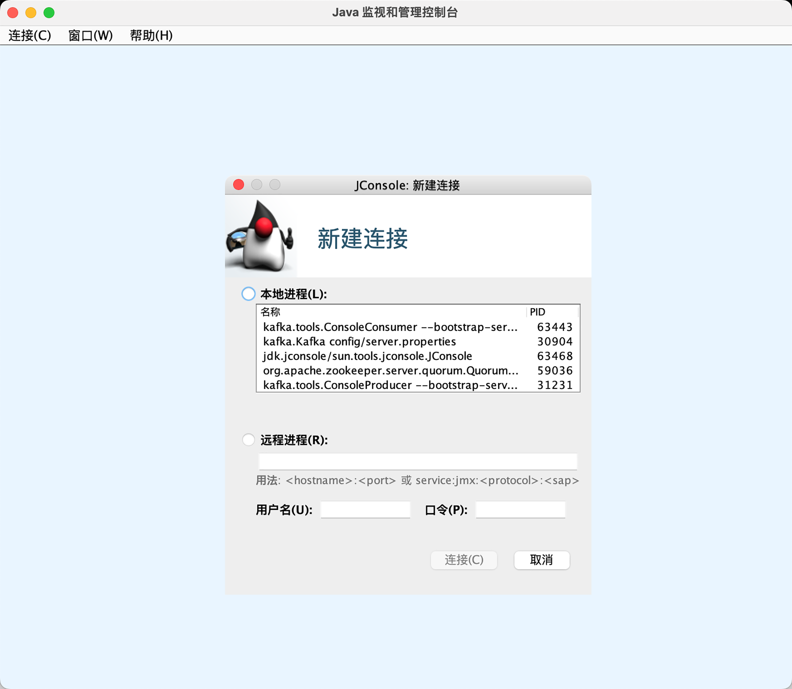
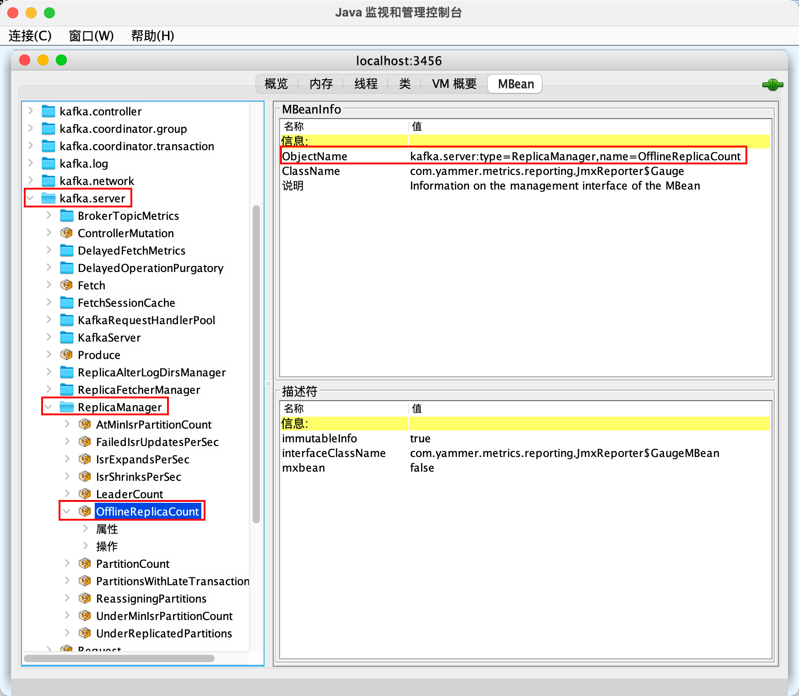
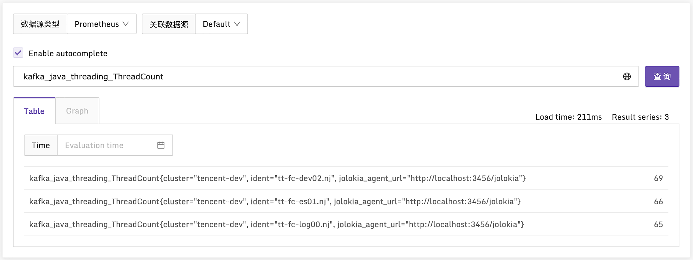
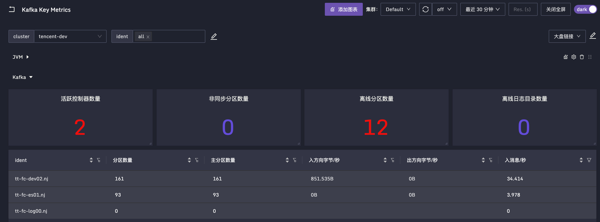
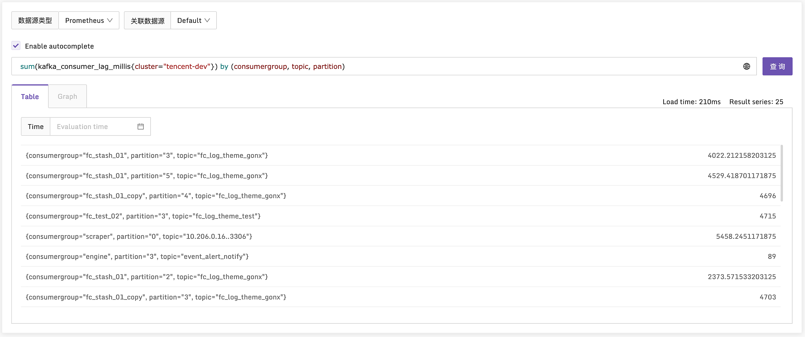

# Kafka监控

要做好 Kafka 的监控，首先要了解  Kafka 的基础概念，比如 Topic（主题）、Partition（分区）、Replica（副本）、AR（Assigned  Replicas）、ISR（In-Sync Replicas）、OSR（Out-of-Sync Replicas）、HW（High  Watermark）、LEO（Log End Offset）等等。其次是要了解 Kafka  的架构，通过架构才能知道要重点监控哪些组件，下面我们就先来看一下 Kafka 的架构图。

## 1. Kafka 架构


上面绿色部分  PRODUCER（生产者）和下面紫色部分 CONSUMER（消费者）是业务程序，通常由研发人员埋点解决监控问题，如果是 Java 客户端也会暴露 JMX 指标。

**组件运维监控层面着重关注蓝色部分的 BROKER（Kafka 节点）和红色部分的 ZOOKEEPER。**

ZooKeeper 也是 Java  语言写的，监控相对简单，可以复用 **JMX 监控方式**，另外 ZooKeeper 支持 mntr 四字命令，可以获取 ZooKeeper  内部健康状况。

新版 ZooKeeper 连四字命令都不需要了，直接**内置暴露了 Prometheus 协议的 metrics 接口**，直接抓取即可。

我们重点关注 Broker 节点的监控，也就是 Kafka 自身的监控，通常从四个方面着手。

- **Kafka 进程所在机器的监控**：这个参考前面第  11 讲的内容，重点关注 CPU、硬盘 I/O、网络 I/O。
- **JVM 监控**：Kafka 是个 Java 进程，所以需要常规的 JVM 监控，通过 JMX 方式暴露。
- **Kafka 自身的指标**：也是通过 JMX 方式暴露，比如消息数量、流量、分区、副本的数量等。
- **各个 consumer 的  lag 监控**：即消息堆积量，是各类 MQ 都应该监控的指标。


## 2. JMX 简介

JMX（Java Management Extensions）是一个为应用程序植入管理功能的框架。Java 程序接入 JMX 框架之后，可以把一些类的属性和方法暴露出来，用户就可以使用 JMX 相关工具来读取或操作这些类。

比如一个类是 Person，有 Name 和 Age 两个属性，如果把 Person 做成一个 MBean，我们就可以在 JConsole 里直接查到 Person 属性的值，也可以修改这些属性。

> 注：MBean 是被管理的 Java 对象，JConsole 是 JMX 的一个管理工具。

我们可以通过 JConsole 直接操作 JavaBean，那 JConsole 对 JavaBean 来说是什么？

打个比方吧，其实就像是 PHPMyAdmin  之于 MySQL，我们可以通过 PHPMyAdmin  直接操作数据库，这样说你大概能理解了吧。如果你没有理解也没关系，从监控的角度，我们只要知道如何通过 JMX 读取 Kafka  的指标即可。下面我们就来看一下 Kafka 如何开启 JMX 端口。

### 2.1 Kafka 开启 JMX

Kafka 的配置文件在 config 目录，各种脚本在 bin 目录，要让 Kafka 开启 JMX，肯定是要修改某个配置项或者调整某个脚本的，具体调整哪里呢？我们在 Kafka 的部署目录搜索一下看看。

```shell
grep -i jmx -r config
grep -i jmx -r bin
```

在 bin 目录下搜索 jmx，可以看到有两个脚本出现了这个关键字，一个是  `bin/kafka-run-class.sh`，另一个是 `bin/windows/kafka-run-class.bat`。显然 bat  结尾的文件是 Windows 环境的批处理文件，sh 结尾的才是 Linux、Mac 下使用的脚本文件。打开  kafka-run-class.sh 看一下里边的关键配置。

```shell

# JMX settings
if [ -z "$KAFKA_JMX_OPTS" ]; then
  KAFKA_JMX_OPTS="-Dcom.sun.management.jmxremote -Dcom.sun.management.jmxremote.authenticate=false  -Dcom.sun.management.jmxremote.ssl=false "
fi

# JMX port to use
if [  $JMX_PORT ]; then
  KAFKA_JMX_OPTS="$KAFKA_JMX_OPTS -Dcom.sun.management.jmxremote.port=$JMX_PORT "
fi

...

# Launch mode
if [ "x$DAEMON_MODE" = "xtrue" ]; then
  nohup "$JAVA" $KAFKA_HEAP_OPTS $KAFKA_JVM_PERFORMANCE_OPTS $KAFKA_GC_LOG_OPTS $KAFKA_JMX_OPTS $KAFKA_LOG4J_OPTS -cp "$CLASSPATH" $KAFKA_OPTS "$@" > "$CONSOLE_OUTPUT_FILE" 2>&1 < /dev/null &
else
  exec "$JAVA" $KAFKA_HEAP_OPTS $KAFKA_JVM_PERFORMANCE_OPTS $KAFKA_GC_LOG_OPTS $KAFKA_JMX_OPTS $KAFKA_LOG4J_OPTS -cp "$CLASSPATH" $KAFKA_OPTS "$@"
fi
```

如果 KAFKA_JMX_OPTS  变量为空，就给它赋值，赋值的那一行内容，实际就是开启 JMX 的关键参数。如果 JMX_PORT 变量不为空，就再加上  -Dcom.sun.management.jmxremote.port 这个参数，通过某个端口暴露 JMX 数据，最后把  KAFKA_JMX_OPTS 放到启动命令里。

这就很清晰了，只要启动 Kafka 之前，在环境变量里嵌入 JMX_PORT 变量，Kafka 就会监听这个端口，暴露 JMX 数据，我们试试。

```shell
export JMX_PORT=3457; ./bin/kafka-server-start.sh config/server.properties
```

启动之后，检查 Kafka 的端口监听，就会发现除了原本监听的 9092 端口，现在也监听了 3457 端口，我们使用 JConsole 工具连上来看看。如果你之前安装过 JDK，直接在命令行里输入 jconsole 就能打开 JConsole 页面。



我们选择远程进程，输入  localhost:3457，然后点击连接，选择不安全的连接，就进入了 JConsole 主页面。默认进来是概览页面，我们选择  MBean，左侧就看到了一个树形结构的多个对象。举个例子，依次点击  kafka.server、ReplicaManager、OfflineReplicaCount，右侧会展示  MBeanInfo，里边尤其要注意的是 ObjectName，后面我们获取 JMX 数据的时候，会频繁用到这个属性。



OfflineReplicaCount 是 Broker 的一个关键指标，点击下面的属性，就可以看到具体的值。

通过 JConsole  的页面确实可以查到各个监控指标的数据，但真正和监控系统对接的话，还是需要使用编程的方式来获取。JMX 的端口走的是 RMI 协议，是 Java  独有的 RPC 协议，其他语言没法调用。好在有工具可以把它转为 HTTP 协议，常见的工具有两个，一个是 Prometheus 生态的  **jmx_exporter_javaagent**，一个是 **Jolokia**。Jolokia 也是个 JavaAgent，jmx_exporter  可以把 JMX 指标导出为 Prometheus metrics 格式，Jolokia 可以把 JMX 指标导出为 JSON 格式，差别不大。

不过 Kafka 暴露的 JMX 指标实在是太多了，如果不过滤全部导出，每个 Broker 轻轻松松就几万个 JMX 指标，大型互联网公司的话，基本上都有几百个 Broker，这个量就有点儿大了。

过滤方式主要有两种:

* 一种是过滤  MBean，通过白名单的方式指定，这些 MBean  采集的数据如果有些还不想要，就做二次过滤，通过黑名单的方式指定，比如根据指标名字做过滤。
* jmx_exporter 指定 MBean  过滤规则是通过一个配置文件实现的，如果这个配置文件发生变化，就要重启 Java 进程，动作有点儿重。

而 Jolokia 的过滤规则都可以在采集器 agent 侧实现，修改过滤规则只需要重启采集器即可，不需要重启要监控的 Java 进程，动作相对轻一些。所以个人倾向使用 Jolokia。

### 2.2 Kafka 开启 Jolokia

首先下载 Jolokia 的 javaagent jar 包，解压到 /opt/jolokia 目录下。然后在 kafka-run-class.sh 找到 JMX 相关的配置，在 JMX_PORT 相关逻辑下面增加三行。

```shell

# JMX settings
if [ -z "$KAFKA_JMX_OPTS" ]; then
  KAFKA_JMX_OPTS="-Dcom.sun.management.jmxremote -Dcom.sun.management.jmxremote.authenticate=false  -Dcom.sun.management.jmxremote.ssl=false "
fi

# JMX port to use
if [  $JMX_PORT ]; then
  KAFKA_JMX_OPTS="$KAFKA_JMX_OPTS -Dcom.sun.management.jmxremote.port=$JMX_PORT "
fi

########## adding lines
if [ "x$JOLOKIA" != "x" ]; then
  KAFKA_JMX_OPTS="$KAFKA_JMX_OPTS -javaagent:/opt/jolokia/jolokia-jvm-1.6.2-agent.jar=host=0.0.0.0,port=3456"
fi
```

例子里的 3456 是 Jolokia 监听的端口，可以换成别的，只要别跟机器上的其他端口冲突就行。加了一个 JOLOKIA 变量的判断，如果这个变量不为空，就开启 Jolokia；如果变量为空就不开启，方便在外部控制。此时我们可以重新启动 Kafka。

```shell
export JOLOKIA=true; export JMX_PORT=3457; nohup ./bin/kafka-server-start.sh config/server.properties &> stdout.log &
```

验证 Jolokia 是否在正常工作，请求其 /jolokia/version 接口即可。下面是我的环境的请求示例，你可以看一下。

```shell

# curl -s 10.206.16.8:3456/jolokia/version | jq .
{
  "request": {
    "type": "version"
  },
  "value": {
    "agent": "1.6.2",
    "protocol": "7.2",
    "config": {
      "listenForHttpService": "true",
      "maxCollectionSize": "0",
      "authIgnoreCerts": "false",
      "agentId": "10.206.16.8-2012615-50134894-jvm",
      "debug": "false",
      "agentType": "jvm",
      "policyLocation": "classpath:/jolokia-access.xml",
      "agentContext": "/jolokia",
      "serializeException": "false",
      "mimeType": "text/plain",
      "maxDepth": "15",
      "authMode": "basic",
      "authMatch": "any",
      "discoveryEnabled": "true",
      "streaming": "true",
      "canonicalNaming": "true",
      "historyMaxEntries": "10",
      "allowErrorDetails": "true",
      "allowDnsReverseLookup": "true",
      "realm": "jolokia",
      "includeStackTrace": "true",
      "maxObjects": "0",
      "useRestrictorService": "false",
      "debugMaxEntries": "100"
    },
    "info": {
      "product": "jetty",
      "vendor": "Eclipse",
      "version": "9.4.43.v20210629"
    }
  },
  "timestamp": 1669277907,
  "status": 200
}
```

上面返回的内容表示 Jolokia 在正常工作，下面我们就可以使用监控 agent 来采集 Jolokia 的数据了。


JMX 数据分两类，一类是和 JVM 相关的，一类是和 Kafka 相关的，我们先来看一下 JVM 相关的采集规则。

## 3. JVM 指标

Categraf 的配置目录 conf  下面，默认有一个 input.jolokia_agent_kafka 的目录，放置了 Kafka 的 Jolokia 拉取规则的样例。把   input.jolokia_agent_kafka 重命名为  input.jolokia_agent，然后修改此目录下面的  kafka.toml，重点关注 urls 和 labels 两个配置。

```toml

[[instances]]
urls = ["http://localhost:3456/jolokia"]
labels = { cluster = "kafka-cluster-demo" }
```

这里我建议你用 Categraf 采集本机的 Kafka，并为采集的数据附加一个名为 cluster 的标签。因为一个公司通常有多个 Kafka 集群，使用 cluster 标签可以做出区分。通过 test 参数测试一下采集的指标是否正常。

```shell
./categraf --test --inputs jolokia_agent
```

如果输出大量的指标，就说明采集逻辑是正常的，稍等片刻，重启 Categraf，再去监控系统查询一下，看看数据是否正常上报了。



我们看下图中的指标，ThreadCount 表示 JVM 里的线程数，类似的还有 DaemonThreadCount，表示后台线程数，PeakThreadCount 表示历史峰值线程数。JVM 要重点关注 GC 的情况和内存的情况，我们看下相关指标。

GC 主要看次数和时间，分为 YongGC 和  FullGC，YongGC 很正常，频率也比较高，FullGC 正常情况下很少发生，如果经常发生，FullGC 程序的性能就会受影响。GC  次数的指标是 **`kafka_java_garbage_collector_CollectionCount`**，是一个 Counter  类型单调递增的值。GC 时间的指标是 **`kafka_java_garbage_collector_CollectionTime`**，也是一个  Counter 类型单调递增的值。这类指标我们通常使用 **increase** 或 **irate** 函数计算增量或速率，不关心当前值是多少。

内存的指标是  kafka_java_memory_pool_Usage_used，单位是 byte。有个 name 标签标识了具体是哪个区域的内存大小，比如  Eden 区、Survivor 区、Old 区。下面仪表盘的中间部分，就是这个内存指标，变化比较剧烈的是 Eden 区，每隔一段时间就会 GC  一次，Eden 区的内存使用量就会降下来，过段时间又会随着使用而上升，然后再次 GC，量又会降下来，循环往复。


所有 Java 类程序，都需要关注这些 JVM 的指标，相关指标的采集方法在 kafka.toml 中有样例，就是这些 java.lang 打头的 MBean。

```toml

[[instances.metric]]
  name  = "java_runtime"
  mbean = "java.lang:type=Runtime"
  paths = ["Uptime"]

[[instances.metric]]
  name  = "java_memory"
  mbean = "java.lang:type=Memory"
  paths = ["HeapMemoryUsage", "NonHeapMemoryUsage", "ObjectPendingFinalizationCount"]

[[instances.metric]]
  name     = "java_garbage_collector"
  mbean    = "java.lang:name=*,type=GarbageCollector"
  paths    = ["CollectionTime", "CollectionCount"]
  tag_keys = ["name"]

[[instances.metric]]
  name  = "java_last_garbage_collection"
  mbean = "java.lang:name=G1 Young Generation,type=GarbageCollector"
  paths = ["LastGcInfo/duration"]
  # paths = ["LastGcInfo/duration", "LastGcInfo/GcThreadCount", "LastGcInfo/memoryUsageAfterGc"]

[[instances.metric]]
  name  = "java_threading"
  mbean = "java.lang:type=Threading"
  paths = ["TotalStartedThreadCount", "ThreadCount", "DaemonThreadCount", "PeakThreadCount"]

[[instances.metric]]
  name  = "java_class_loading"
  mbean = "java.lang:type=ClassLoading"
  paths = ["LoadedClassCount", "UnloadedClassCount", "TotalLoadedClassCount"]

[[instances.metric]]
  name     = "java_memory_pool"
  mbean    = "java.lang:name=*,type=MemoryPool"
  paths    = ["Usage", "PeakUsage", "CollectionUsage"]
  tag_keys = ["name"]
```

到这里，JVM  的常规指标我们就讲完了。如果你想采集其他指标，可以使用 JConsole 连到 JMX 端口，查看相关 MBean 的信息，在 Categraf 里新增  [[instances.metric]] 的配置即可。kafka.toml 中还有很多 Kafka Broker 的 JMX  指标，下面我们来一探究竟。

## 4. Kafka 指标

Kafka 的指标实在是太多了，其中有些指标只是为了调试而设置的。哪些指标更为关键，应该配置告警，哪些应该放到仪表盘里，哪些压根就无需关注，比较难梳理，好在目前这方面的资料比较丰富，一定程度上是有共识的，下面我们就来讲一下这些共识性的关键指标。

### 4.1 活跃控制器数量

**`MBean：broker kafka.controller:type=KafkaController,name=ActiveControllerCount`**

一个 Kafka 集群有多个  Broker，正常来讲其中一个 Broker 会是活跃控制器，且只能有一个。从整个集群角度来看，SUM 所有 Broker  的这个指标，结果应该为 1。如果 SUM 的结果为 2，也就是说，有两个 Broker 都认为自己是活跃控制器。这可能是网络分区导致的，需要重启 Kafka Broker 进程。如果重启了不好使，可能是依赖的 ZooKeeper 出现了网络分区，需要先去解决 ZooKeeper  的问题，然后重启 Broker 进程。

### 4.2 非同步分区数量

**`MBean：kafka.server:type=ReplicaManager,name=UnderReplicatedPartitions`**

这个指标是对每个 Topic  的每个分区的统计，如果某个分区主从同步出现问题，对应的数值就会大于 0。常见的原因比如某个 Broker 出问题了，一般是 Kafka  进程问题或者所在机器的硬件问题，那么跟这个 Broker  相关的分区就全部都有问题，这个时候出问题的分区数量大致是恒定的。如果出问题的分区数量不恒定，可能是集群性能问题导致的，需要检查硬盘  I/O、CPU 之类的指标。

### 4.3 离线分区数量

**`MBean：kafka.controller:type=KafkaController,name=OfflinePartitionsCount`**

这个指标只有集群控制器才有，其他 Broker 这个指标的值是 0，表示集群里没有 leader 的分区数量。Kafka 主要靠 leader 副本提供读写能力，如果有些分区没有 leader 副本了，显然就无法读写了，是一个非常严重的问题。

### 4.4 离线日志目录数量

**`MBean：kafka.log:type=LogManager,name=OfflineLogDirectoryCount`**

Kafka 是把收到的消息存入 log  目录，如果 log 目录有问题，比如写满了，就会被置为 Offline，及时监控离线日志目录的数量显然非常有必要。如果这个值大于  0，我们想进一步知道具体是哪个目录出问题了，可以查询 ` MBean：kafka.log:type=LogManager,name=LogDirectoryOffline,logDirectory=*"`，LogDirectory 字段会标明具体是哪个目录。

### 4.5 流入流出字节和流入消息

这是典型的吞吐指标，既有 Broker 粒度的，也有 Topic 粒度的，名字都一样，Topic 粒度的指标数据 MBean ObjectName 会多一个 topic=xx 的后缀。

#### 4.5.1 流入字节

**`MBean：kafka.server:type=BrokerTopicMetrics,name=BytesInPerSec`**

这个指标 Kafka 在使用 `Yammer  Metrics` 埋点的时候，设置为了 Meter 类型，所以 Yammer 会自动计算出  Count、OneMinuteRate、FiveMinuteRate、FifteenMinuteRate、MeanRate 等指标，也就是 1  分钟、5 分钟、15 分钟内的平均流入速率，以及整体平均流入速率。而 Count 表示总量，如果时序库支持 PromQL，我们就只采集  Count，其他的不用采集，后面使用 PromQL 对 Count 值做 irate 计算即可。

#### 4.5.2 流出字节

**`MBean：kafka.server:type=BrokerTopicMetrics,name=BytesOutPerSec`**

和 BytesInPerSec 类似，表示出向流量。不过需要注意的是，流出字节除了普通消费者的消费流量，也包含了副本同步流量。

#### 4.5.3 流入消息

`MBean：kafka.server:type=BrokerTopicMetrics,name=MessagesInPerSec`

BytesInPerSec 和 BytesOutPerSec 都是以 byte 为单位统计的，而 MessagesInPerSec 是以消息个数为单位统计的，也是 Meter 类型，相关属性都一样。

需要解释一下的是，Kafka 不提供 MessagesOutPerSec，你可能觉得有点儿奇怪，有入就得有出才正常嘛。这是因为消息被拉取的时候，Broker 会把整个“消息批次”发送给消费者，并不会展开“批次”，也就没法计算具体有多少条消息了。

### 4.6 分区数量

`MBean：kafka.server:type=ReplicaManager,name=PartitionCount`

这个指标表示某个 Broker 上面总共有多少个分区，包括 leader 分区和 follower 分区。如果多个 Broker 分区不均衡，可能会造成有些 Broker 消耗硬盘空间过快，这是需要注意的。

### 4.7 leader 分区数量

**`MBean：kafka.server:type=ReplicaManager,name=LeaderCount`**

这个指标表示某个 Broker 上面总共有多少个 leader 分区，leader 分区负责数据读写，承接流量，所以 leader 分区如果不均衡，会导致某些 Broker 过分繁忙而另一些 Broker 过分空闲，这种情况也是需要我们注意的。



## 5. Lag 监控

每个 Topic 会分成多个  Partition，每个 Partition 都有一个当前的 offset，表示生产的消息已经堆积到了什么位置。每个 Partition  可以被多个 consumergroup 消费，consumergroup 消费的时候，针对某个 Partition 也会有一个 offset  表示消费位置。生产者的 offset 减去 consumergroup 的 offset，就表示滞后量。

**这个滞后量如果过大，就表示消费者可能遇到了问题**，没有及时干活，这是个很严重的问题。比如监控数据对即时性要求就很高，如果通过 Kafka 传输监控数据，但滞后量很大，最后呈现给用户的图表可能是几分钟之前的数据，那意义就不大了。

监控 Lag 数据有两个办法，一个是从  consumer 的 JMX 中获取，不过只有 Java 的程序才能这么做；一个是通过网络上的一些 Exporter 获取，因为 Lag  数据太重要了，所以有人专门写了 Exporter 来采集。很多 consumer 都是非 Java 语言实现的，所以这里我们重点介绍  Exporter 的方案。

滞后性，表示消息差值数量，这个不太方便设置告警规则，因为一些消息量巨大的 Topic Lag 值看起来很大，但是很快就消费完了，有些消息量很小的 Topic，consumer 可能都挂了，但是 Lag  值仍然很小。要是能预估一下队列里的消费时长就好了，参考历史数据情况进行预估，如果这个预估的时长变大了，就表示有问题了。其实，还真有这样的  Exporter，Categraf 就直接集成的这个 Exporter 的代码，你可以直接使用。

Categraf 中怎么配置 Kafka 的 Lag 监控呢？使用 kafka 采集插件，配置文件在 conf/input.kafka/kafka.toml，最核心的配置有两个，一个是 labels，一个是 kafka_uris，你可以看下配置样例。

```toml
[[instances]]
labels = { cluster="tencent-dev" }
log_level = "error"
kafka_uris = ["10.206.16.3:9092"]
```

在 labels 中，我还是建议你加一个  cluster 标签。因为一个公司一般有多个 Kafka 集群，我们可以通过这个标签区分，其次就是  kafka_uris，一般写一两个就可以了，不用把所有 Broker 地址全部写上，Categraf 会作为一个 Kafka client  连上集群，读取 offset 数据。如果是老集群，offset 信息存在 ZooKeeper 上，这个时候就要设置  use_zookeeper_lag = true，并通过 zookeeper_uris 改写 ZooKeeper 的连接地址。

Kafka 这个采集插件，采集的最核心的指标是 kafka_consumer_lag_millis，你可以看一下样例。



指标单位是毫秒，就是一个预估消费时长，这个指标我也放到了仪表盘中，你可以直接导入夜莺使用，或者参考里边的 PromQL 自己制作 Grafana 大盘。到这里，Kafka 监控的关键点就介绍完了，这一讲的内容有点儿长，下面我们来做一个总结。

## 6. 总结

Kafka  是现代分布式系统架构中非常常见的组件，Kafka 运行是否正常，消息消费是否正常，都需要重点关注。监控可以从 4  个层面着手，机器、JVM、Kafka Broker、Lag。当然，ZooKeeper 作为 Kafka 重度依赖组件，也需要监控，还有就是  producer 和 consumer 也是需要监控的。不过那是应用程序层面的监控了，需要研发人员协同来做，作为组件平台方来讲，我们重点还是放在 Broker 层面。

机器监控层面，我们重点关注 CPU、硬盘 I/O、网络 I/O，以及 Kafka 进程层面占用的资源，比如打开了多少文件句柄，最大可以打开多少句柄等。

JVM 监控层面，重点关注 GC 和内存的情况，如果频繁发生 Old 区 Full GC，Kafka 性能肯定会受影响。所有 Java 程序都应该监控 JVM，比如 Tomcat、JBoss、Hadoop，走 JMX 这个路径是一个典型的方式。

Kafka Broker JMX 指标，重点关注一些大面上的异常指标，Kafka 暴露了太多的 JMX 指标，如果无法抓取到关键指标，Kafka 监控绝对是噩梦。

Lag 监控，也就是 Topic Partition 的消费者滞后监控，是 Queue 类程序需要关注的典型指标。因为一旦消费者跟不上生产者的速度，消息就会积压，数据即时性也就会受很大影响。