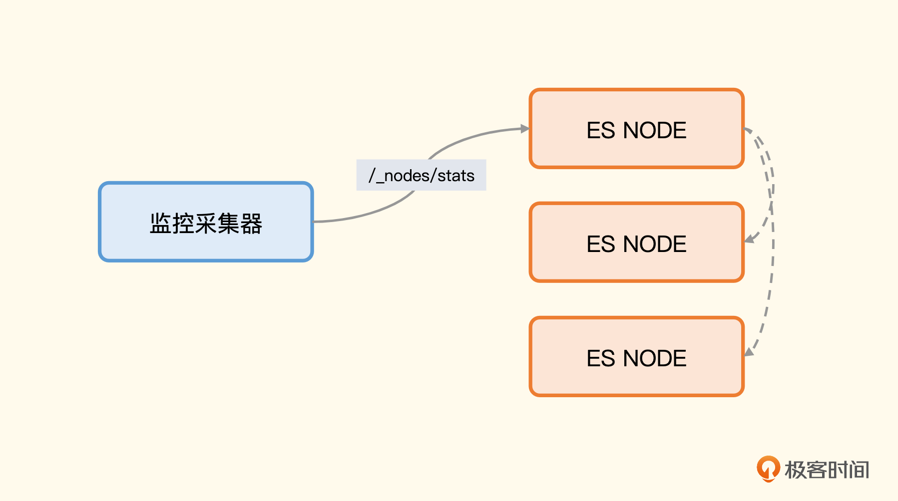
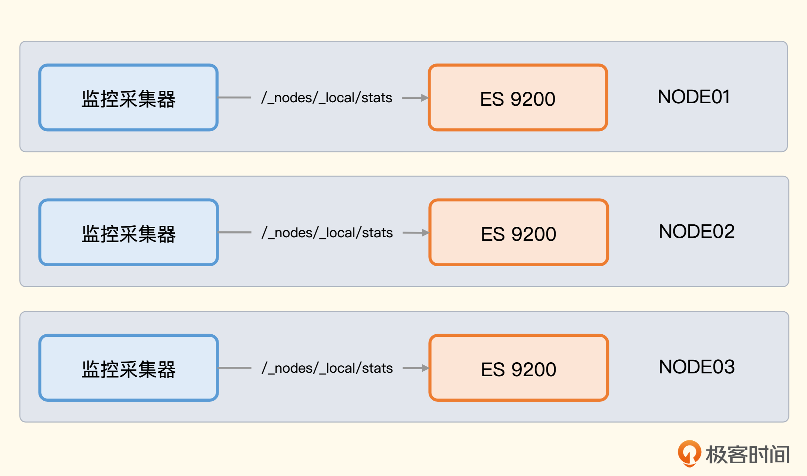
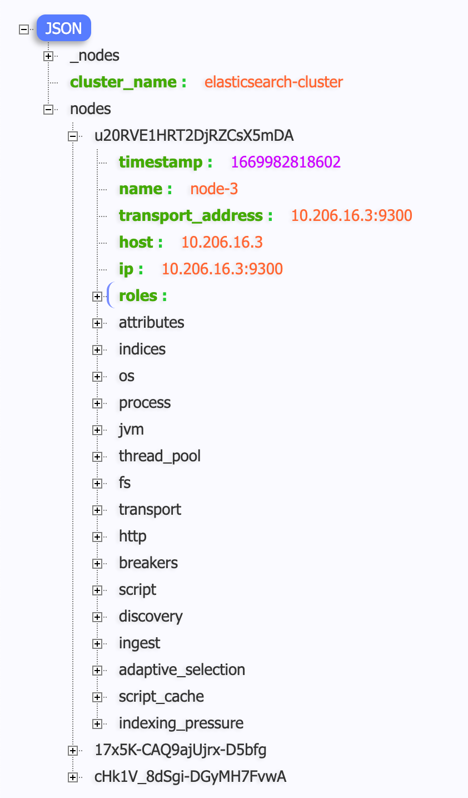
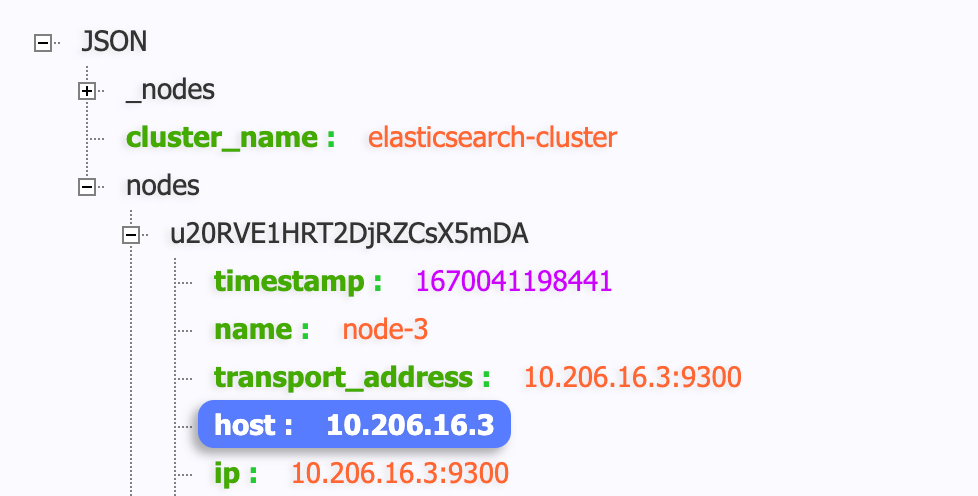
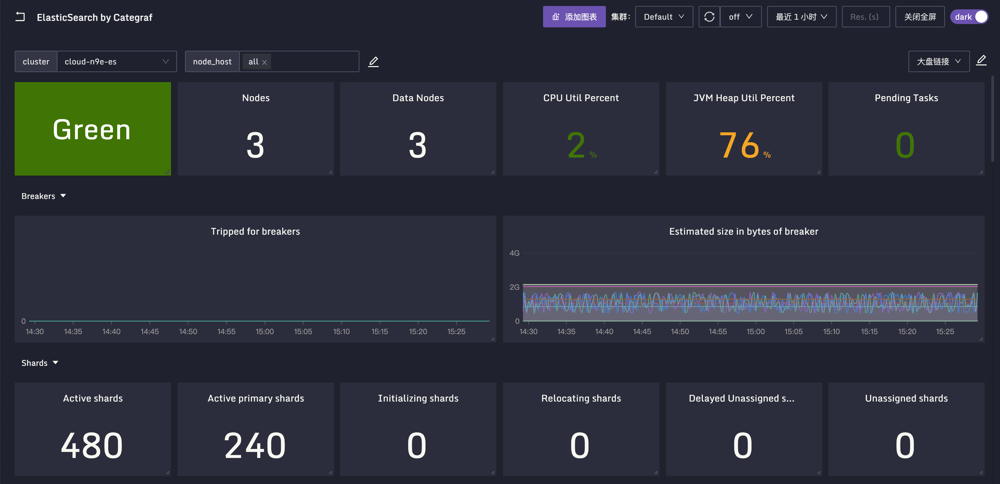
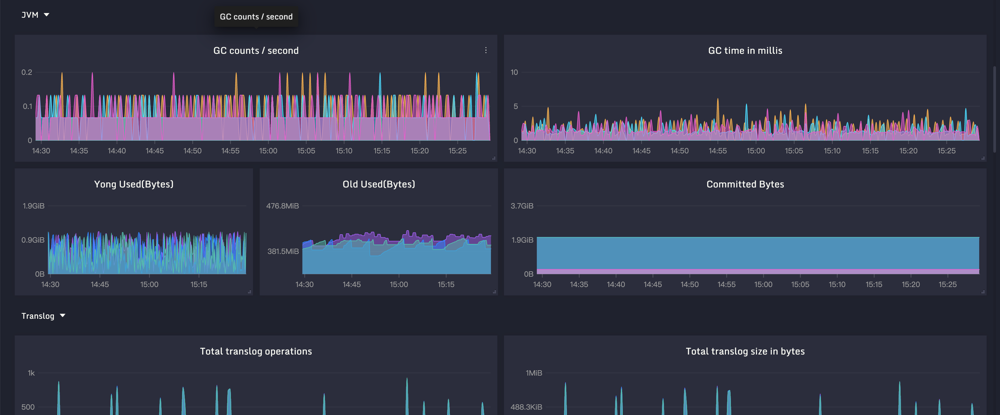
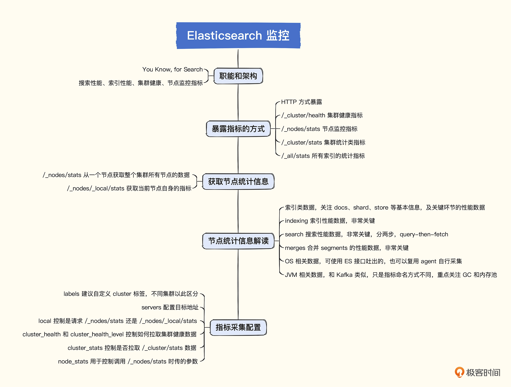

# 15. ES组件监控

Elasticsearch  的监控同样包含多个方面，操作系统、JVM 层面的关注点和 Kafka 是一样的，这里不再赘述。我们重点关注 Elasticsearch  本身的指标，它自身的指标有很多，哪些相对更关键呢？这就要从 Elasticsearch 的职能和架构说起了。

## 1. Elasticsearch 的职能和架构

Elasticsearch 的核心职能就是对外提供搜索服务，所以**搜索请求的吞吐和延迟**是非常关键的，搜索是靠底层的索引实现的，所以**索引的性能指标**也非常关键，Elasticsearch 由一个或多个节点组成集群，**集群自身是否健康**也是需要监控的。

ElasticSearch 的架构非常简单，一个节点就可以对外提供服务，不过单点的集群显然有容灾问题，如果挂掉了就万事皆休了。一般生产环境，至少搭建一个三节点的集群。


三个节点分别部署三个 Elasticsearch 进程，这三个进程把 cluster.name 都设置成相同的值，就可以组成一个集群。Elasticsearch 会自动选出一个 master  节点，负责管理集群范围内所有的变更，整个选主过程是自动的，不用我们操心。

架构图里绿色的 P0、P1、P2 表示三个分片，R0、R1、R2 代表分片副本，每个分片有两个副本，也就是说 P0 对应两个 R0，P1 对应两个 R1，P2 对应两个 R2。这些分片和副本是否成功分配到 Node 上并落盘写入，也是一个重要的监控指标。

我们知道 Elasticsearch 哪些方面的指标比较关键了，下面再来看一下这些指标是怎么获取的。

## 2. Elasticsearch 暴露指标的方式

Elasticsearch 通过 HTTP 接口方式暴露指标，集群整体的健康状况使用` /_cluster/health` 获取，我这里使用 curl 测试一下。

```shell

ulric@localhost ~ % curl -s -uelastic:Pass1234 'http://10.206.16.3:9200/_cluster/health?pretty'
{
  "cluster_name" : "elasticsearch-cluster",
  "status" : "green",
  "timed_out" : false,
  "number_of_nodes" : 3,
  "number_of_data_nodes" : 3,
  "active_primary_shards" : 216,
  "active_shards" : 432,
  "relocating_shards" : 0,
  "initializing_shards" : 0,
  "unassigned_shards" : 0,
  "delayed_unassigned_shards" : 0,
  "number_of_pending_tasks" : 0,
  "number_of_in_flight_fetch" : 0,
  "task_max_waiting_in_queue_millis" : 0,
  "active_shards_percent_as_number" : 100.0
}
```

这里最关键的信息是 **status 字段**:

- `green`：，表示主分片和副本分片都处于正常状态；
- `yellow`：，表示主分片处于正常状态，但副本分片有异常状态；
- `red`：，则表示有主分片是异常状态

其他字段大都是集群统计数据，比如  number_of_nodes 表示集群共有 3 个节点，number_of_data_nodes 表示集群共有 3  个数据节点，active_primary_shards 表示共有 216 个活跃主分区，active_shards 表示共有 432  个活跃分区。

注意，在集群正常的情况下，对集群里的所有节点请求这个接口，都会返回相同的信息，所以要获取集群健康状况只需要请求某一个节点即可，或者都请求一下也没啥大不了的，数据量也不大。

除了 `/_cluster/health`  之外，其他常见的接口还有 ` /_cluster/health?level=indices`、`/_nodes/stats`、`/_nodes/_local/stats`、`/_cluster/stats`、`/_all/_stats`，其中最有用的是**获取节点统计数据的接口**

### 2.1 获取节点统计信息

获取节点统计信息可以使用两个接口，`/_nodes/stats` 会返回集群中所有节点的信息，`/_nodes/_local/stats` 则只返回请求的那个节点的信息。

这样的设计，从监控角度就有两种采集方式，一种是在中心部署监控采集器，连上某一台 Elasticsearch 节点，从这个节点获取所有其他节点的信息



另一种方式，是把监控采集器部署在所有节点上，调用各自节点上 ES 进程的 local 接口，你可以看一下架构图。



`/_nodes/stats` 接口返回的内容非常丰富，我们看一个样例。



nodes 字段是个大 map，map 的  key 是 node_id，map 的 value 就是各类统计指标，其中最关键的是 **indices**，也就是索引相关的。除此之外，还有 os  操作系统相关的、process 进程相关的、jvm 相关的、thread_pool 线程池相关的、fs 文件系统相关的、transport  网络吞吐相关的、http 各个接口请求相关的各类指标。我们可以通过在 URL 中传参的方式告诉 ES 只返回某些特定数据，比如：

```shell
/_nodes/stats/indices,os
```

这种接口调用方式，只会返回索引和操作系统相关的指标。这个接口返回的内容非常关键，下面我来挑选一些关键信息为你解读一下。

### 2.2 节点统计信息解读

索引部分是最关键的，我们先来看索引部分。

```json

    "indices": {
        "docs": {
            "count": 45339548,
            "deleted": 2
        },
        "shard_stats": {
            "total_count": 144
        },
        "store": {
            "size_in_bytes": 15882899598,
            "total_data_set_size_in_bytes": 15882899598,
            "reserved_in_bytes": 0
        },
```

- docs 统计了文档的数量，包括还没有从段（segments）里清除的已删除文档数量。
- shard_stats 统计了分片的数量。
- store 统计了存储的情况，包括主分片和副本分片总共耗费了多少物理存储。

indexing、get、search、merges、refresh、flush 等，都是类似的，统计了 Elasticsearch 各个关键环节的吞吐和耗时，其中比较关键的是 indexing、search、merge，下面是我的数据样例。

```json

    "indexing": {
        "index_total": 18595844,
        "index_time_in_millis": 1868991,
        "index_current": 0,
        "index_failed": 0,
        "delete_total": 0,
        "delete_time_in_millis": 0,
        "delete_current": 0,
        "noop_update_total": 0,
        "is_throttled": false,
        "throttle_time_in_millis": 0
    },
    "search": {
        "open_contexts": 0,
        "query_total": 140847,
        "query_time_in_millis": 59976,
        "query_current": 0,
        "fetch_total": 1333,
        "fetch_time_in_millis": 990,
        "fetch_current": 0,
        "scroll_total": 3,
        "scroll_time_in_millis": 86,
        "scroll_current": 0,
        "suggest_total": 0,
        "suggest_time_in_millis": 0,
        "suggest_current": 0
    },
    "merges": {
        "current": 0,
        "current_docs": 0,
        "current_size_in_bytes": 0,
        "total": 64937,
        "total_time_in_millis": 7170896,
        "total_docs": 1341992706,
        "total_size_in_bytes": 140455785325,
        "total_stopped_time_in_millis": 0,
        "total_throttled_time_in_millis": 160061,
        "total_auto_throttle_in_bytes": 6707112372
    },
```

- **indexing** 是统计索引过程，ES  的架构里，索引是非常关键的一个东西，索引的吞吐和耗时都应该密切关注，index_total 和 index_time_in_millis 都是  Counter 类型的指标，单调递增。如果要求取最近一分钟的索引数量和平均延迟，就需要使用 increase  函数求增量。throttle_time_in_millis  表示受限的时间，索引不能耗费太多资源，如果占用了太多资源就影响其他的操作，应该限制一下，这个指标就表示总计被限制的时间。
- **search**  描述在活跃中的搜索（open_contexts）数量、查询的总数量，以及自节点启动以来在查询上消耗的总时间。用  increase(query_time_in_millis[1m]) / increase(query_total[1m])  计算出来的比值，可以用来粗略地评价你的查询有多高效。比值越大，每个查询花费的时间越多，到一定程度就要考虑调优了。
- **fetch** 统计值展示了查询处理的后一半流程，也就是 query-then-fetch 里的 fetch 部分。如果 fetch 耗时比 query 还多，说明磁盘较慢，可能是获取了太多文档，或者搜索请求设置了太大的分页。
- **merges** 包括了 Lucene  段合并相关的信息。它会告诉你目前在运行几个合并，合并涉及的文档数量，正在合并的段的总大小，以及在合并操作上消耗的总时间。合并要消耗大量的磁盘  I/O 和 CPU 资源，如果 merge 操作耗费太多资源，也会被限制，即 total_throttled_time_in_millis  指标。

除了索引信息之外， 还直接在 HTTP 接口中暴露了操作系统、进程、JVM 相关的指标，下面我们也简单看一下。

操作系统层面的指标，我们既可以使用  Elasticsearch 自己暴露的数据，也可以使用监控采集器直接采集的数据，比如 Categraf 默认会采集  CPU、内存、磁盘、IO、网络、进程等多种信息。这里要解决的关键问题是，**如何通过相同的大盘变量过滤 Elasticsearch  的指标和操作系统的指标**？从 Elasticsearch 接口采集到的指标，会带有一个 node_host 标签，放置的是机器的  IP，一般都是使用这个标签过滤数据，比如下面这个样例



要想使用机器 IP  过滤操作系统的指标，就需要在采集器上报数据的时候，同时把机器 IP 作为标签上报。如果是 Categraf 的话，hostname 要配置为  "$ip"，如果是 Telegraf 的话，就需要手工配置写死本机 IP 了。当然，如果不使用监控采集器采集的操作系统指标，直接复用  Elasticsearch 接口中吐出的那些指标，就没有这个过滤问题了，因为 Elasticsearch 的数据标签天然就是统一的。

JVM 相关的指标，上一讲 Kafka  监控我们已经介绍过了，不过当时是采用 JMX 方式获取的，Elasticsearch 则更为简单，在`  /_nodes/stats ` 接口中直接暴露了 JVM 指标，GC、内存池等数据都有，只是最终的指标命名方式和 Kafka 不同。下面是 JVM 相关指标的样例，供你参考。

```json

{
    "timestamp": 1670041198455,
    "uptime_in_millis": 92165514,
    "mem": {
        "heap_used_in_bytes": 752914744,
        "heap_used_percent": 35,
        "heap_committed_in_bytes": 2147483648,
        "heap_max_in_bytes": 2147483648,
        "non_heap_used_in_bytes": 265504880,
        "non_heap_committed_in_bytes": 269877248,
        "pools": {
            "young": {
                "used_in_bytes": 289406976,
                "max_in_bytes": 0,
                "peak_used_in_bytes": 1283457024,
                "peak_max_in_bytes": 0
            },
            "old": {
                "used_in_bytes": 419899904,
                "max_in_bytes": 2147483648,
                "peak_used_in_bytes": 641861120,
                "peak_max_in_bytes": 2147483648
            },
            "survivor": {
                "used_in_bytes": 43607864,
                "max_in_bytes": 0,
                "peak_used_in_bytes": 115343360,
                "peak_max_in_bytes": 0
            }
        }
    },
    "threads": {
        "count": 150,
        "peak_count": 161
    },
    "gc": {
        "collectors": {
            "young": {
                "collection_count": 8501,
                "collection_time_in_millis": 157112
            },
            "old": {
                "collection_count": 0,
                "collection_time_in_millis": 0
            }
        }
    },
    "buffer_pools": {
        "mapped": {
            "count": 2490,
            "used_in_bytes": 9927166600,
            "total_capacity_in_bytes": 9927166600
        },
        "direct": {
            "count": 129,
            "used_in_bytes": 6017066,
            "total_capacity_in_bytes": 6017065
        },
        "mapped - 'non-volatile memory'": {
            "count": 0,
            "used_in_bytes": 0,
            "total_capacity_in_bytes": 0
        }
    },
    "classes": {
        "current_loaded_count": 28215,
        "total_loaded_count": 28291,
        "total_unloaded_count": 76
    }
}
```

## 3. Elasticsearch 指标采集配置

`Categraf` 采集 Elasticsearch 的配置文件在  `conf/input.elasticsearch/elasticsearch.toml`，我们看里边的一些关键配置。

```toml
labels = { cluster="cloud-n9e-es" }
```

先看标签配置，这里**建议手工加一个  cluster 标签**，因为一个公司通常有多个 Elasticsearch 集群，可以通过这个标签来区分。实际上，每个 Elasticsearch 集群都有一个自己的名字，会放到 cluster_name 标签中，不过我担心你的多个集群可能使用了相同的  cluster.name，这样就没法通过内置的名字区分了，还是在标签中直接新增一个 cluster 标签比较稳妥。

```toml
servers = ["http://localhost:9200"]
local = false
```

servers 用来配置  Elasticsearch 节点的地址，如果后面的 local 配置为 false，这里就只需要配置一台 Elasticsearch  的地址，通过这一个地址拉取整个集群的监控指标，还有其他机器的节点指标。这种方式虽然简单，但是可能会对集群性能有些影响，集群节点数量不多是可以的，但如果集群有大几十个节点，就要注意一下了。

如果 local 配置为 true，就表示从 ` /_nodes/_local/stats` 获取本地节点的信息，那就要分别采集所有的节点了。要么在 servers 中配置所有的  Elasticsearch 节点列表做远程拉取，要么就是把 Elasticsearch 和 Categraf 做成一对一的关系，让  Categraf 采集 localhost 上的 Elasticsearch。

```toml

cluster_health = true
## Adjust cluster_health_level when you want to obtain detailed health stats
## The options are
##  - indices (default)
##  - cluster
cluster_health_level = "cluster"
```

cluster_health  用来控制是否采集集群健康指标，即是否拉取`  /_cluster/health `接口的数据。这个接口可以传入 level 参数，用  cluster_health_level 来控制是拉取 cluster 集群级别的数据，还是拉取 indices 索引级别的数据。平时监控  cluster 级别就够了，如果 cluster 级别是 yellow 或 red 了，可以再手工查看索引级别的数据，排查具体是哪个索引的问题。

```toml
cluster_stats = true
```

cluster_stats 用于控制是否采集集群层面的统计指标，默认采集即可，这个数量不算大。这个数据只从主节点拉取，如果当前节点不是主节点，会跳过这个采集逻辑。

```toml

## Indices to collect; can be one or more indices names or _all
## Use of wildcards is allowed. Use a wildcard at the end to retrieve index names that end with a changing value, like a date.
# indices_include = ["zipkin*"]

## use "shards" or blank string for indices level
indices_level = ""
```

indices_include  支持通配符，配置要采集哪些索引的 _stats 信息，如果想采集所有的索引，设置为 _all 就可以。索引的 _stats 接口也支持  level 参数，可以用 indices_level 来控制是获取索引颗粒度的数据，还是分片颗粒度的数据。

```toml

node_stats = ["jvm", "breaker", "process", "os", "fs", "indices", "thread_pool", "transport"]
```

node_stats 用来选择拉取节点的哪些信息，就是  `/_nodes/stats/indices`,os 接口最后面那部分参数。默认配置就够用了，里边有个 HTTP 部分，指标非常多，不建议采集，默认配置里也没有。





## 4. 总结

Elasticsearch 的核心职能就是提供搜索服务，搜索的数据要提前建立索引，为了支持海量数据，Elasticsearch 还能组成集群，所以**搜索性能**、**索引性能**、**集群健康状况**以及集群中各个节点的健康状况，就是我们要监控的核心指标。

Elasticsearch  暴露指标的方式非常简单，就是几个 HTTP 接口，返回 JSON 数据，直接拉取解析即可，比 JMX 方式简单得多。我们要关注的核心是  `/_cluster/health` 和 `/_nodes/stats` 这两个接口，一个用来获取整个集群的监控数据，一个用来获取节点粒度的监控数据。  `/_nodes/stats `接口返回的数据非常丰富，不但有索引类指标，还有 OS、JVM、Process、ThreadPool  指标，重点关注索引相关的指标和 JVM 相关的指标。

